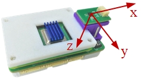

本小结将介绍传感器的校准方法，包括IMU和磁力计。传感器校准是状态估计与控制中至关重要的一步，它有利于降低状态估计与控制误差。

# 基本使用
RflyPilot内置了传感器校准功能，校准操作主要通过控制台命令实现，校准结果将以文本文件的形式存储在RflyPilot飞控中。
在这之前，需要设置``rflypilot.txt``中的``valid_mode = 3``，以启用实验模式。校准参数将被以文本形式存储在``calibration.txt``，在首次使用时，该文件需要手动创建，文件内容可以设置为如下
```
accel_scale_0 = 0.000000
accel_scale_1 = 0.000000
accel_scale_2 = 0.000000
accel_offset_0 = 0.000000
accel_offset_1 = 0.000000
accel_offset_2 = 0.000000
gyro_scale_0 = 1.000000
gyro_scale_1 = 1.000000
gyro_scale_2 = 1.000000
gyro_offset_0 = 0.000000
gyro_offset_1 = 0.000000
gyro_offset_2 = 0.000000
mag_scale_0 = 0.000000
mag_scale_1 = 0.000000
mag_scale_2 = 0.000000
mag_offset_0 = 0.000000
mag_offset_1 = 0.000000
mag_offset_2 = 0.000000
```
!!! TIP
    注意文件内容的格式，要保留空格。主要陀螺仪的尺度系数``gyro_scale_{0,1,2}``应设置为``1``。
# 陀螺仪校准
在控制台中输入``calib gyro``，等待一段时间，即可完成校准。
```
vehicle > calib gyro
gyro calibration mode
Calibration thread created with process pid : 1036
Calibration starting
vehicle > thread calibration running
start gyro calibration process......
Please do not move the aircraft
 gyro calibration parameter is:
 gyro_x_offset =        0.013428
 gyro_y_offset =        0.006644
 gyro_z_offset =        -0.002992
calibration finished !
```
!!! TIP
    在校准的过程中一定要保持RflyPilot处于静止状态；这里只校准了陀螺仪的零偏，没有校准陀螺仪的尺度系数。建议在上电之后IMU器件温度稳定后再进行校准。

在输入``calib save``即可保存校准数据。
```
vehicle > calib gyro
gyro calibration mode
Calibration thread created with process pid : 1036
Calibration starting
vehicle > thread calibration running
start gyro calibration process......
Please do not move the aircraft
 gyro calibration parameter is:
 gyro_x_offset =        0.013428
 gyro_y_offset =        0.006644
 gyro_z_offset =        -0.002992
calibration finished !
```
通过``calib load``即可查看校准参数
```
vehicle > calib load
LOAD calibration mode
Calibration thread created with process pid : 1220
Calibration starting
vehicle > thread calibration running
key has 18
accel_scale_0 is 0.000000
accel_scale_1 is 0.000000
accel_scale_2 is 0.000000
accel_offset_0 is 0.000000
accel_offset_1 is 0.000000
accel_offset_2 is 0.000000
gyro_scale_0 is 1.000000
gyro_scale_1 is 1.000000
gyro_scale_2 is 1.000000
gyro_offset_0 is 0.013428
gyro_offset_1 is 0.006644
gyro_offset_2 is -0.002992
mag_scale_0 is 0.000000
mag_scale_1 is 0.000000
mag_scale_2 is 0.000000
mag_offset_0 is 0.000000
mag_offset_1 is 0.000000
mag_offset_2 is 0.000000
calibration finished !
```

!!! TIP
校准结果将被存储在与``rflypilot``可执行文件同级的``calibration.txt``中。

# 加速度计校准
RflyPilot的坐标系定义如下



加速度计的校准采用了常用的六面校准法。输入指令``calib accel``，便开始了校准。
RflyPilot首先会提示，``Please place the (+x) axis of the aircraft upward``,使用者将``+x``轴朝上静置即可，待姿态稳定后，RflyPilot将提示``Please do not move the aircraft``，此时需要静置飞控，RflyPilot正在采集加速度计数据。待数据采集完成后，将会提示``Please place the (+z) axis of the aircraft upward``，后续操作以此类推，这里不再赘述。
```
vehicle > calib accel
accel calibration mode
Calibration thread created with process pid : 1406
Calibration starting
vehicle > thread calibration running
start accel calibration process......
Please place the (+x) axis of the aircraft upward
PX_UP is detected!
accel data: accel x = 9.7417, y = -0.7865, z = -0.2954
Please do not move the aircraft
step1 is completed!
A = 1381.0000

Please place the (+z) axis of the aircraft upward
PZ_UP is detected!
accel data: accel x = -0.6721, y = -0.4783, z = 9.6469
Please do not move the aircraft
step2 is completed!
A = 2763.0000

Please place the (-x) axis of the aircraft upward
NX_UP is detected!
accel data: accel x = -9.7803, y = -0.4612, z = -0.1445
Please do not move the aircraft
step3 is completed!
A = 4144.0000

Please place the (-z) axis of the aircraft upward
NZ_UP is detected!
accel data: accel x = 0.1338, y = 0.0895, z = -9.9620
Please do not move the aircraft
step4 is completed!
A = 5526.0000

Please place the (-y) axis of the aircraft upward
NY_UP is detected!
accel data: accel x = -0.2413, y = -9.8469, z = -0.2811
Please do not move the aircraft
step5 is completed!
A = 6908.0000

Please place the (+y) axis of the aircraft upward
PY_UP is detected!
accel data: accel x = 0.3244, y = 9.7597, z = 0.8039
Please do not move the aircraft
step6 is completed!
A = 8290.0000

1.000355 0.998360 0.997071 
0.022998 0.011350 0.116596
calibration finished !
```
加速度计校准完成后，利用``calib save``保存即可，数据将写入到``calibration.txt``中。


# 磁力计校准
磁力计校准使用的方法是椭球拟合。输入命令``calib mag``, RflyPilot首先会提示，``Please place the (-z) axis of the aircraft upward``,使用者将``-z``轴朝上静置即可，待姿态稳定后，出现提示
``Please rotate the aircraft around -z axis``，此时绕``-z``轴缓慢单向旋转RflyPilot即可（旋转方向任意），RflyPilot需要使用者在7秒钟内绕一圈，7秒钟后，校准程序将自动进入下一阶段，``Please place the (+x) axis of the aircraft upward``, 此时按照步骤操作即可。
```
Calibration thread created with process pid : 786
Calibration starting
vehicle > thread calibration running
start mag calibration process......Please place the (-z) axis of the aircraft upward
NZ_UP is detected!
accel data: accel x = -0.2963, y = 0.3090, z = -10.0077
mag data: mag x = -0.099583, y = 0.007083, z = 0.261417
Please rotate the aircraft around -z axis
step1 is completed!
A = 695.0000
 Please place the (+x) axis of the aircraft upward
PX_UP is detected!
accel data: accel x = 9.7193, y = 0.5693, z = -0.6472
mag data: mag x = -0.553500, y = -0.092667, z = -0.231417
Please rotate the aircraft around +x axis
step2 is completed!
A = 1391.0000
 Please place the (-x) axis of the aircraft upward
NX_UP is detected!
accel data: accel x = -9.8372, y = 0.5258, z = -0.2316
mag data: mag x = 0.443917, y = 0.078917, z = -0.021417
Please rotate the aircraft around -x axis
step3 is completed!
A = 2087.0000
 Please place the (-y) axis of the aircraft upward
NY_UP is detected!
accel data: accel x = -0.3618, y = -9.7050, z = -0.9713
mag data: mag x = 0.136000, y = 0.345000, z = -0.076250
Please rotate the aircraft around -y axis
step4 is completed!A = 2783.0000
 Please place the (+y) axis of the aircraft upward
PY_UP is detected!
accel data: accel x = 1.3548, y = 9.6512, z = 0.4473
mag data: mag x = 0.017250, y = -0.516000, z = 0.026833
Please rotate the aircraft around +y axis
step5 is completed!
A = 3479.0000
 Please place the (+z) axis of the aircraft upward
PZ_UP is detected!
accel data: accel x = -0.3423, y = 0.1443, z = 9.5431
mag data: mag x = -0.063333, y = -0.248750, z = -0.517500
Please rotate the aircraft around +z axis
step6 is completed!
A = 4175.0000
 1.912619 2.172892 2.158774 
0.092122 0.183707 0.208248
calibration finished !
```

磁力计计校准完成后，利用``calib save``保存即可，数据将写入到``calibration.txt``中。


!!! TIP
    磁力计的校准需要在磁场干扰较少的区域，要尽量避免周围有金属物质。

# 其他
1. 如要查看当前传感器校准参数，可以输入命令``calib load``，即可列出当前校准参数。
2. RflyPilot默认保存了校准时读取的传感器数据，这些数据在校准完成之后将存储在当前目录，分别名为``accel_data.txt``, ``gyro_data.txt``, ``mag_data.txt``，这些数据可用于在MATLAB中进行处理。
3. 首次使用RflyPilot时，``calibration.txt``文件并不存在，需要使用者自行创建。
