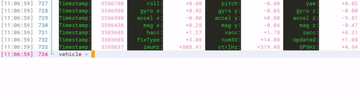

控制台功能是RflyPilot飞控的一个非常实用的功能，它起到了远程调试的功能，它可以作为简易的飞控地面站功能。它支持多种调试指令，也可也由开发者自行增加指令。于此同时，控制台还支持实时显示当前状态信息，包括姿态、GPS信号质量、运行频率等等。在室外进行实飞实验时，利用手机SSH连接到RflyPilot控制台，即可简单便捷地获取飞控状态信息，查看异常信息。

# 状态信息
如上图所示，RflyPilot飞控的状态信息会实时更新。

|符号|说明|单位|
|---|---|---|
|Timestamp|当前行变量的时间戳|微秒|
|roll/pitch/yaw|姿态角|deg|
|gyro_{x,y,z}|角速度|deg/s|
|accel_{x,y,z}|加速度|m/s^2|
|mag_{x,y,z}|磁力计输出||
|hacc|GPS水平精度因子||
|vacc|GPS垂直精度因子||
|sacc|GPS速度精度因子||
|fixType|GPS工作模式||
|numSV|GPS卫星数||
|Updated|状态估计初始化完成标志位||
|imuHz|IMU采样率|Hz|
|ctrlHz|控制器运行频率|Hz|
|GPSHz|GPS数据更新频率|Hz|

