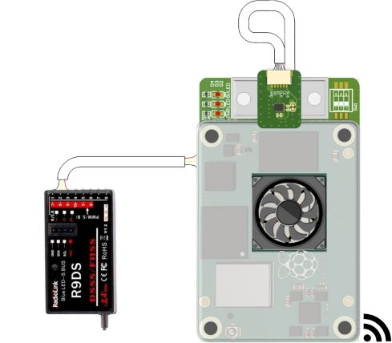
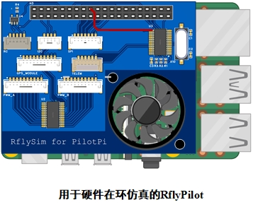

本节将介绍RflyPilot的硬件连接情况，以及在不同仿真验证模式下的最小硬件配置方案。
RflyPilot底板的硬件接口如下图所示

IMU传感器板如下图所示，⑩应与司相连

线序介绍
====

**①辅助PWM接口（用于舵机等）**

|左|||||||||右|
|----|----|----|----|----|----|----|----|----|----|
|GND|PWM1|PWM2|PWM3|PWM4|PWM5|PWM6|PWM7|PWM8|5V|

!!! 注意
    应避免RflyPilot飞控对外供电，主副PWM的``5V``引脚应悬空。

**②主PWM接口（用于电调）**

|左|||||||||右|
|----|----|----|----|----|----|----|----|----|----|
|GND|PWM1|PWM2|PWM3|PWM4|PWM5|PWM6|PWM7|PWM8|5V|

!!! 注意
    应避免RflyPilot飞控对外供电，主副PWM的``5V``引脚应悬空。

**③预留串口**

|左|||||右|
|----|----|----|----|----|----|
|GND|RTSB|CTSB|RXB|TXB|5V|

**④IMU接口**

|上|||||下|
|----|----|----|----|----|----|
|GND|MISO|MOSI|CLK|CS|3V3|

**⑤SBUS/IBUS接收机接口**

|左||||右|
|----|----|----|----|----|
|GND|NC|NC|RC|5V|

**⑥GPS接口**

|左|||||||||右|
|----|----|----|----|----|----|----|----|----|----|
|5V|TX|RX|SCL|SDA|NC|NC|3V3|NC|GND|

**⑦外置IIC总线接口**

|左|||右|
|----|----|----|----|
|5V|SCL|SDA|GND|

**⑧电源模块接口(推荐PM06)**

|上|||||下|
|----|----|----|----|----|----|
|5V|5V|BAT_V|BAT_I|GND|GND|

**⑨Type-C USB**
!!! 注意
    默认该TypeC接口允许作为电源输入接口，但无法对外供电。如需供电需短接电路板上的``D1``二极管。

**⑩IMU板接口**

|上|||||下|
|----|----|----|----|----|----|
|3V3|CS|CLK|MOSI|MISO|GND|

连接说明
====

## MIL仿真
由于MIL仿真的控制器与模型均运行于Simulink中，故其并不需要RflyPilot飞控硬件。为了让仿真时飞行器具有更好地操控性，可以将遥控器连接至计算机。这一小结将主要介绍如何连接遥控器用以进行MIL仿真。

需要用一根USB线连接到计算机，此时便可以通过遥控器控制Simulink中的仿真模型。这里笔者使用的是富斯的遥控器，该遥控器可以作为计算机的输入设备，同时Simulink中也有相应的组件支持（Pilot Joystick），驱动正确安装完成后，将在设备管理器中出现“人机接口设备/HID-compliant game controller”。

遥控器指令输入对应``MIL``仿真模型中的``Real RC``模块。
!!! Tips
    Simulink中的``Pilot Joystick``模块，除了支持富斯的这款遥控器之外，也支持其他遥控器，笔者在这里没有过多尝试。
## SIH仿真
在SIH仿真模式下，由于飞控软件和被控对象都运行在RflyPilot中，并不需要连接到飞行器本体上，但是由于仿真过程中，需要输入控制指令，此时，还需要将遥控器的接收机连接到RflyPilot上。
故在SIH仿真模式下，硬件准备上，只需要RflyPilot与遥控器和接收机，最后通过WIFI连接到计算机，在RflySim3D上进行显示。

## HIL仿真

HIL仿真相比于实飞实验的区别是RflyPilot飞控直接连接到半物理仿真系统上而不是连接到真实的飞机上。所以进行HIL仿真需要半物理仿真系统，这里笔者采用的是课题组自研的[硬件在环实时仿真平台](https://rflybuaa.github.io/RflySimRTDoc/)。利用该平台可以完成被控对象的模拟，同时也利用其强大的FPGA，实现传感器级的精细模拟。

由于进行HIL仿真并不需要真实的传感器，为了方便进行HIL仿真，笔者直接使用树莓派4B和“Rflysim for Pilot"接口板代替RflyPilot连接到硬件在环仿真平台上。

将以上两个组件拼接完成后，得到了可以用于硬件在环仿真的RflyPilot。
!!! 注意
    由于前期硬件电路设计存在一些小问题，串口芯片``SC16IS752IPW``的中断引脚没有连接到树莓派的``BCM24``号引脚，故这里增加了红色飞线

参考[硬件在环实时仿真平台](https://rflybuaa.github.io/RflySimRTDoc/)中的教程进行硬件连接，便可以得到如下半物理联合仿真平台。

!!! TIP
    由于飞控运行时处理器功率增加，为保障计算性能，建议使用大功率电源连接树莓派。

!!! 注意
    应避免RflyPilot飞控对外供电，主副PWM的``5V``引脚应悬空。

## 实飞实验

实飞实验的硬件连接可以参考如下图。

!!! TIP
    RflyPilot在工作时对电源功率有一定的要求，这里推荐读者使用[PM06](https://item.taobao.com/item.htm?abbucket=6&id=672144201759&ns=1&spm=a21n57.1.0.0.aa48523cB5cd8x&skuId=4837788524900)电源模块。
    
!!! 注意
    应避免RflyPilot飞控对外供电，主副PWM的``5V``引脚应悬空。