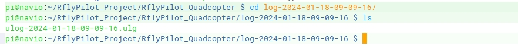

RflyPilot支持多种日志系统，包括ulog，本小结将对ulog的使用进行详细介绍。
# Ulog简介
ULog是用于记录消息的文件格式。该格式是自包含的，即它包含记录的格式和消息类型。关于Ulog的详细介绍请参考[ULog文件格式](https://docs.px4.io/main/zh/dev_log/ulog_file_format.html)。

# 基本配置
启用系统日志，修改配置文件``rflypilot.txt``，使``sys_log_en = 1``，即可启用记录系统日志。默认频率为50Hz，可以通过修改``src/application/ulog_thread.cpp``文件改变日志记录频率。
```
void * thread_ulog(void * dir)
{
    core_bind(ULOG_CORE);
    timespec thread_log_sleep;
    thread_log_sleep.tv_sec = 0;
    thread_log_sleep.tv_nsec = 20*1000*1000;//20ms	默认50Hz
```
配置完成后，运行``./rflypilot``，即可在当前目录下创建一个以``log``开头并包含时间的文件夹，用于存储log。



!!! Warning
    <font face="黑体" color=red size=3>注：RflyPilot默认只会在EXP和HIL模式下启用ulog记录线程。日志记录频率不可过高，否则会导致系统资源紧张。</font>

# 日志的解析

记录得到的ulog日志文件可以通过SSH拷贝到计算机中用``ulog2csv``函数进行解析，也可以直接使用日志查看工具[FlightPlot](https://github.com/DrTon/FlightPlot)，这里不再赘述。