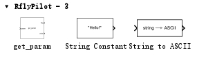
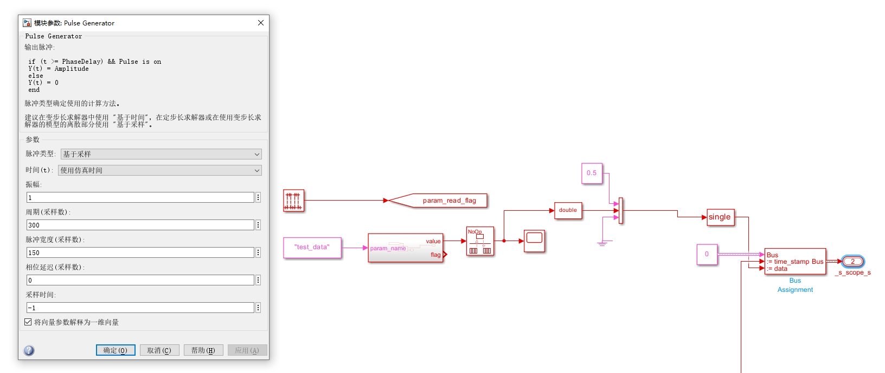
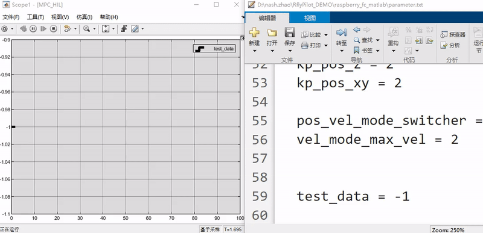

RflyPilot支持在线调参功能，允许在飞控运行时进行参数修改与更新。
# MIL
解压工程文件中``slib/rflypilotblock.zip``，并添加到工程路径中，运行脚本``slblocks.m``，此时RflyPilot模块便被加载到Simulink中，此时打开``MIL_HIL.slx``模型文件，即可在“库浏览器”中看到相应的模块。相应的调用示例，读者可以参考``RflyPilot_Model/debug_tools/ParamUpdate.slx``文件，读者可以将改模块复制到MIL仿真模型中。
该参数模块在模型首次运行时将运行一次，读取相应字符串定义的参数，而后在``param_read_flag``的上升沿时将再次触发，继续读取参数，以实现参数更新的目的。

将``parameter.txt``拷贝到工程根目录下，模型在运行时将会从中读取参数。
设置``get_param``模块的采样周期为``-1``。并设置``param_name``为``test_data``。
现给``param_read_flag``脉冲信号，则将在脉冲的上升沿进行参数更新，最后显示到示波器中，如下图所示。

在仿真的过程中修改``parameter.txt``中的``test_data``数值，示波器中的数值会发生相应的变化，而变化周期与脉冲信号周期相同。

!!! TIP
    强烈建议开发者自行引入``param_read_flag``信号，比如由遥控器的开关触发，在修改完``parameter.txt``后，通过遥控器开关触发，这样的触发方式有利于降低参数更新模块对系统资源的占用，因为每个参数更新模块在每次参数更新时均会执行读操作，并且会遍历``parameter.txt``，如果只使用脉冲信号触发，比如会造成系统资源的极大浪费，同时可靠性不高。

# SIH/HIL/EXP

参数更新模块同样可以运用在SIH/HIL模式和实验中。其使用方法与MIL差别不大，仅需将``parameter.txt``文件更新到RflyPilot飞控源码的``config/parameter.txt``中，在使用RflyPilotTools进行上传时，该文件会自动上传至RflyPilot飞控中。在此模式中，笔者强烈建议使用遥控器开关触发参数更新。
