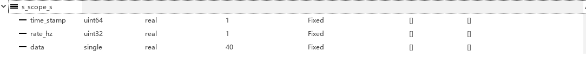

RflyPilot飞控支持将飞行数据通过UDP实时显示在计算机上。本节将以SIH仿真为例介绍示波器系统的基本功能与使用方法。
# RflyPilot的在线示波器
RflyPilot在飞控系统底层支持将一些关键数据传输到远程计算机上。这些数据的类型已经预定义在飞控底层代码中，如需修改，需要自行修改飞控源码，该示波器叫做``system scope``。可由配置文件``rflypilot.txt``进行配置开启或者关闭。另一种示波器为``controller scope``，该示波器用于输出与控制器有关的数据，这些数据的定义可以由开发者自行决定。两种示波器的默认数据更新频率为100Hz，可能受系统运行影响而略有浮动。
# 系统示波器
``system scope``中包含较为丰富的系统状态信息，包括位置、速度、姿态、控制量、运行频率等。RflyPilot通过本机的``UDP3333``端口向局域网广播数据，该数据为一数组，其定义为
```
#define SCOPE_DATA_N 40

typedef struct
{
    uint64_t timestamp;
    uint32_t rate_hz;
    float data[SCOPE_DATA_N];
}scope_data_typedef;

ringbuffer_typedef<scope_data_typedef> system_scope_msg(20,"system_debug_data",LOG_DISABLE);

```
<font face="黑体" color=red size=3>注：关于``system scope``的具体定义，请参考RflyPilot源码文件``src/msg/msg_def.h``。</font>

该示波器具体信息可以参见如下代码，其中``_system_debug_data``为示波器数据。
```
_system_debug_data.data[0] = 1234; //帧头
_system_debug_data.data[1] = get_time_now() / 1e6; //时间戳
_system_debug_data.data[2] = _att.roll; //滚转角
_system_debug_data.data[3] = _att.pitch; //俯仰角
_system_debug_data.data[4] = _att.yaw; //航向角
for(i = 0; i < 3; i++)
{
    _system_debug_data.data[i+5] = _gyro.gyro[i]; //陀螺仪数据（滤波后）
}
for(i = 0; i < 3; i++)
{
    _system_debug_data.data[i+8] = _accel.accel[i]; //加速度计数据 （滤波后）
}
for(i = 0; i< 3; i++)_system_debug_data.data[i+11] = _lpe.pos_ned[i]; //NED位置（估计）
for(i = 0; i< 3; i++)_system_debug_data.data[i+14] = _lpe.vel_ned[i];//NED速度（估计）
for(i = 0; i< 3; i++)_system_debug_data.data[i+17] = _gps.pos_ned[i];//NED位置（GPS）
for(i = 0; i< 3; i++)_system_debug_data.data[i+20] = _gps.vel_ned[i];//NED位置（GPS）
for(i = 0; i < 4; i++)_system_debug_data.data[i+23] = (float)_actuator_output.actuator_output[i];//PWM输出
_system_debug_data.data[27] = actuator_output_msg.publish_rate_hz;//控制器频率
_system_debug_data.data[28] = cf_output_msg.publish_rate_hz;//姿态估计频率
_system_debug_data.data[29] = lpe_output_msg.publish_rate_hz;//位置估计频率
_system_debug_data.data[30] = accel_msg.publish_rate_hz;//IMU消息发布频率
_system_debug_data.data[31] = mag_msg.publish_rate_hz; //磁力计消息发布频率
_system_debug_data.data[32] = baro_msg.publish_rate_hz;//气压计消息发布频率
_system_debug_data.data[33] = _baro.temperature;//温度（气压计）
_system_debug_data.data[34] = _baro.pressure;//气压（气压计）
_system_debug_data.data[35] = _rc_input_msg.channels[0];//遥控器输入CH1
_system_debug_data.data[36] = _rc_input_msg.channels[1];//遥控器输入CH2
_system_debug_data.data[37] = _mag.mag[0];//磁力计数据x轴
_system_debug_data.data[38] = _mag.mag[1];//磁力计数据y轴
_system_debug_data.data[39] = _mag.mag[2];//磁力计数据z轴
```
可见，利用该示波器一次最多显示40个通道数据。
## 配置
### RflyPilot端
RflyPilot端仅需要修改配置文件``config/rflypilot.txt``，首先需要启用系统日志``sys_scope_en = 1``，为``1``表示启用系统示波器，为``2``表示禁用系统示波器。最后设置``station_ip``与``scope_ip``为计算机IP，注意加引号。
```
sys_scope_en = 1
scope_ip = "192.168.199.152"
```
<font face="黑体" color=red size=3>注：在配置项所在行，不能增加注释等无关内容。</font>

至此，RflyPilot端配置完成。
### 电脑端
打开RflyPilot的Simulink工程文件，并打开``debug_tools/udp_recv3_ke.slx``。双击打开①后，配置②``Remote IP address``，该IP应设置为RflyPilot的IP。点击“确定”即可完成设置。


## 使用
运行``./rflypilot``，并启动示波器，通过遥控器进行操作即可。


# 控制器示波器
控制器示波器``controller scope``也使用了与系统示波器同样的原理实现。控制器示波器同样具有40个浮点数通道。其配置方法与系统示波器类似，这里不做过多展开。其主要区别是``controller scope``使用了``UDP3334``端口。开启控制器示波器需要设置``ctrl_scope_en = 1``。

<font face="黑体" color=red size=3>注：为避免系统资源浪费，简易将未使用的示波器设置为关闭。</font>

## 配置自定义示波器数据
``controller scope``的数据输出端口在控制器模块中，在Simulink模型的``MPC_HIL/usrcontroller (MPCControllerCodeGen_Vz)``中，有预定义一输出端口，如下图中②所示。


它在Simulink中的定义如下，双击设置①，将③``data``加入到④``要赋值的元素中``，并“确定”。此时模块①将会增加一端口用于输入数据，维度为40。


``_s_scope_s``的数据定义同RflyPilot代码中一致
```
#define SCOPE_DATA_N 40

typedef struct
{
    uint64_t timestamp;
    uint32_t rate_hz;
    float data[SCOPE_DATA_N];
}scope_data_typedef;

scope_data_typedef _controller_debug;
```
为了演示方便，这里增加一脉冲发生器和常数模块，如下图所示


随后进行代码生成与部署即可，这部分已经在[快速开始](../quick_start/env_install.md)中介绍过了，这里不再赘述。
## 电脑端
电脑端仅需将UDP端口修改为``3334``即可，如下图所示，然后选择需要接收的数据通道。


在此直接进行SIH仿真，即可得到从控制器模块中自定义的数据输出，如下图所示。


不难发现，方波信号并不规整，原因是控制器的运行频率与示波器数据发送的频率异步，示波器的运行频率约为100Hz，而控制器约为333Hz，故出现此问题，这也属于正常现象。