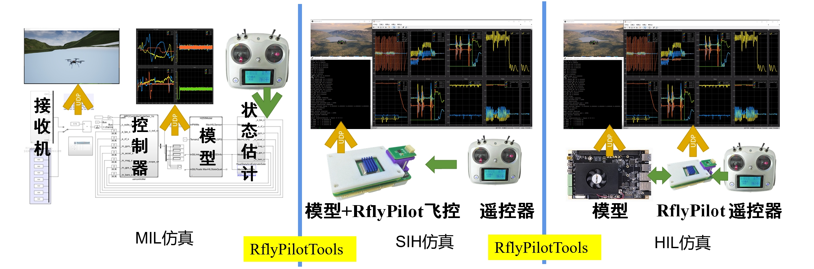

本小结将对常用的三种仿真模式（MIL\SIH\HIL）进行操作介绍。



# MIL
MIL仿真，即模型在环，该仿真模式主要用于进行控制系统的初期验证阶段，用于评估控制器的可控性。利用RflyPilot工程文件夹下的``MIL/MPC_HIL.slx``即可进行MIL仿真。这部分仿真主要在Simulink中进行，其仿真方法，这里不再赘述，具体内容由读者自行决定，相应的内容可以参考[快速使用](../quick_start/env_install.md)中的部分内容。
# SIH
SIH仿真，即仿真器在环，该仿真模式主要用于测试控制器在真实嵌入式系统中的表现。SIH的仿真步骤在[快速使用](../quick_start/env_install.md)中进行了详细介绍，这里也不再赘述。
# HIL
HIL，即半物理仿真，一般作为实飞实验的最后一步，在这个模式中，RflyPilot将直接连接到[硬件在环实时仿真系统](https://rflybuaa.github.io/RflySimRTDoc/)上，其硬件连接方法请参考[硬件连接](./hardware_connection.md)一节中的内容。
在HIL仿真中，仿真操作与SIH基本相同，不同的是需要修改``valid_mode = 2``，同时修改宏定义文件``config/configure.h``中的``USE_RFLYPILOT``为``0``。
```
#define POLL_TIME_US 10*1000// 10*1000ns = 10us
#define TIMER_TICK_RATE 2000
#define SCOPE_DATA_N 40
/* Estimator Thread Core */
#define ATT_EST_CORE 2
#define POS_EST_CORE 2

/* Sensor Thread Core */
#define IMU_CORE 2
#define MAG_CORE 2
#define BARO_CORE 2
#define GPS_CORE 2

/* Control Thread Core */
#define SUBS_CORE 2
#define BASIC_CTRL_CORE 2
#define CTRL_CORE 3

/* SIH Thread Core */
#define SIH_CORE 2

/* Serve Thread Core */
#define SCREEN_CORE 1
#define CONSOLE_CORE 1
#define LOG_CORE 1
#define ULOG_CORE 1

/* Rate Div */
#define USING_THREAD_SYNC 0
#define IMU_LPE 1
#define LPE_ATT 1
#define ATT_CTRL 2

#define USE_RFLYPILOT 0
#define USE_ONESHOT_125 1
#define OFFBOARD_DATA_N 20
#define PWM_FREQ (USE_ONESHOT_125==1?1500:400)
#define SERVO_PWM_FREQ 333
#define I2C_BUS_1 "/dev/i2c-1"
#define I2C_BUS_0 "/dev/i2c-10"

#define TASK_SCHEDULE_DEBUG 0
```

最后重新编译上传即可。

!!! 注意
    <font face="黑体" color=red size=3>由于半物理仿真平台的PWM信号支持标注400HzPWM和Oneshot125，使用者可以根据需要修改该文件进行适配。默认配置为Oneshot125，如需修改为400Hz的PWM，可以设置``USE_ONESHOT_125 0``。</font>


# EXP
EXP，即实飞实验模式，在该模式下，RflyPilot将利用真实的传感器数据计算控制输出，并直接输出PWM控制指令。为启用该模式，读者需要修改``valid_mode = 3``，同时修改宏定义文件``config/configure.h``中的``USE_RFLYPILOT``为``1``。在该模式下，需要开发者自行连接飞控到飞行器上，包括电源模块、GPS、接收机、电调等。

!!! 注意
    <font face="黑体" color=black size=3>由于实飞实验使用了真实的GPS，需要等待状态估计系统收敛后才可以起飞，尤其是当飞控需要用到估计的位置、速度数据的情况。当控制台出现“[lpe] GPS Init status xxx, GPS Alt Origin is xxx”后，说明位置速度数据可用。</font>


如下图所示，这是一架搭载RflyPilot的四旋翼无人机


实飞效果如下

