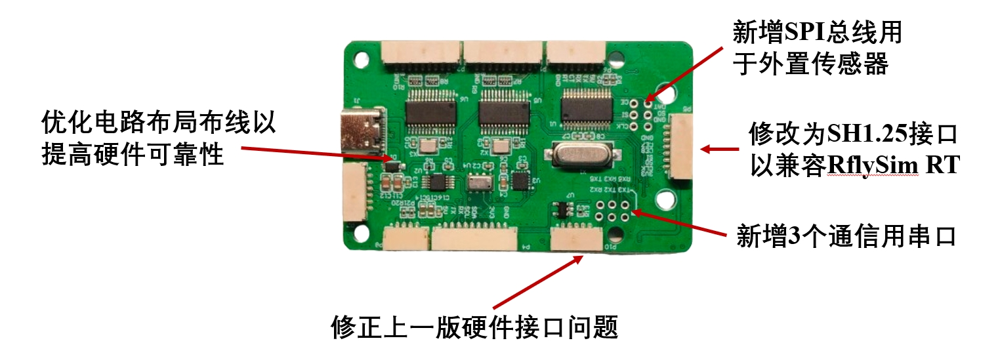
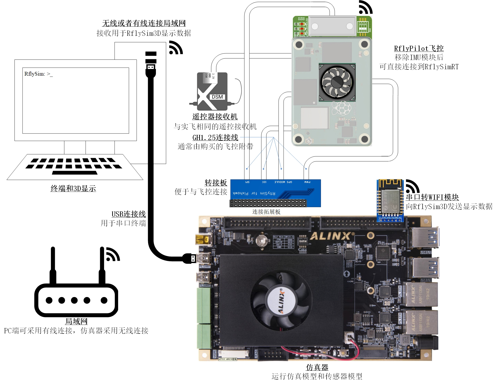
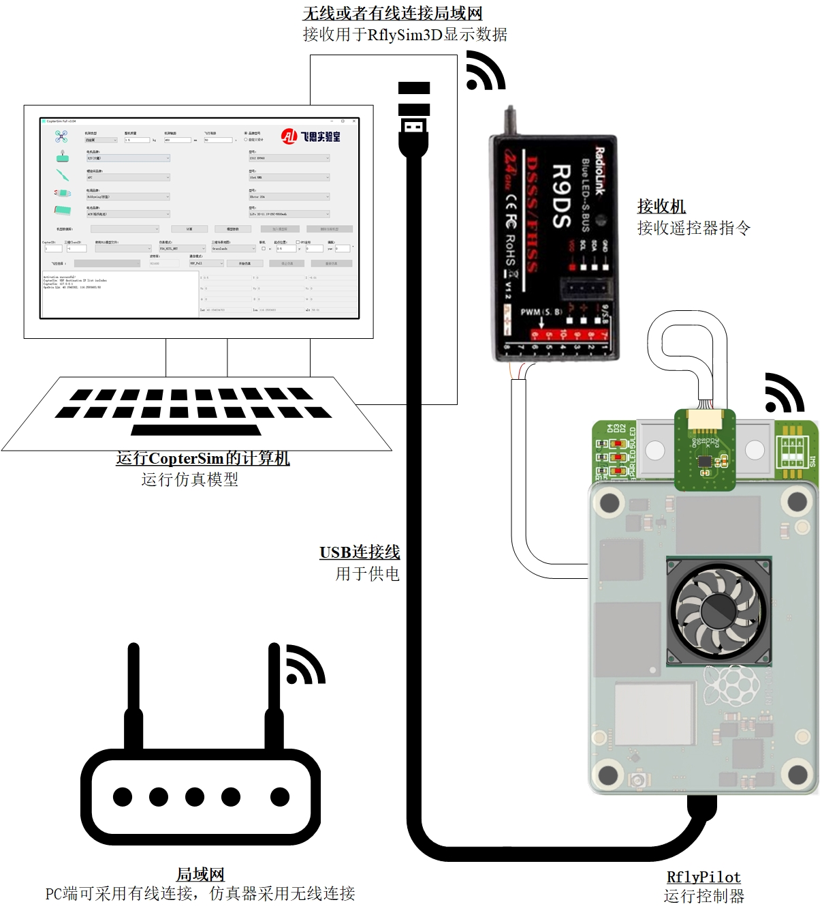

# RflyPilot v1.1
RflyPilot v1.1 在上一版RflyPilot v1.0的基础之上做了一些可靠性、性能和兼容性方面的更新。

## 传感器更新
1. 支持ICM45686，这是一款高性能的IMU芯片，具有较低的噪声和高达4000dps的角速度量程，非常有利于进行高动态的飞行实验。
2. M9N GPS，这是一款高性能的GPS，较M8N具有更佳的收星能力和更高的定位精度，同时导航信息输出频率也更高。
3. LinkTrack UWB，UWB的加入助力了在室内场景下实现厘米级定位。

## 拓展板更新

在RflyPilot v1.1版的基础之上，用户在做HIL仿真时将不再需要树莓派4B计算板和HIL拓展板，RflyPilotv1.1的拓展板将兼容RflySim RT仿真系统，如下图所示。

## CopterSim HIL 支持

RflyPilot正在进行对CopterSim的支持，用于进行基于计算机的HIL仿真和故障注入测试。

