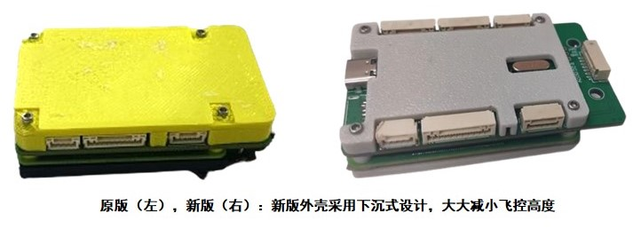

# RflyPilot v1.2
RflyPilot v1.2 在上一版RflyPilot v1.1的基础之上进行使用上的细节更新。

## 软件更新
1. 增加ADS1115驱动，配合``PM05``模块，飞控可以采集到当前电池电压和总工作电流，同时回传到飞控控制台上进行显示，该功能有利于使用者对电池量进行预估，从而合理安排实验。
2. 增加IMU、磁力计多安装方向的支持。该功能允许飞控安装倾斜方式进行安装，从而适配不同的飞行器结构。
3. 在飞控控制台中增加飞控温度的显示功能，以用于检测CPU工作温度，从而避免处理器过热。
4. 增加对特定伺服电机驱动的支持（串口），允许增加新的执行器。
5. 增加对IMU杆臂效应的补偿功能，补偿掉飞行器在失效旋转下不良加速度对状态估计的影响。
6. 增加``Eigen``矩阵库的支持。

## 拓展板更新

在RflyPilot v1.1版硬件基础之上，进一步压缩飞控外壳高度，从而减低飞控安装尺寸要求。

稳定版本的Rflypilot底板正式推出，改正了上一版本中PWM接口的问题。

