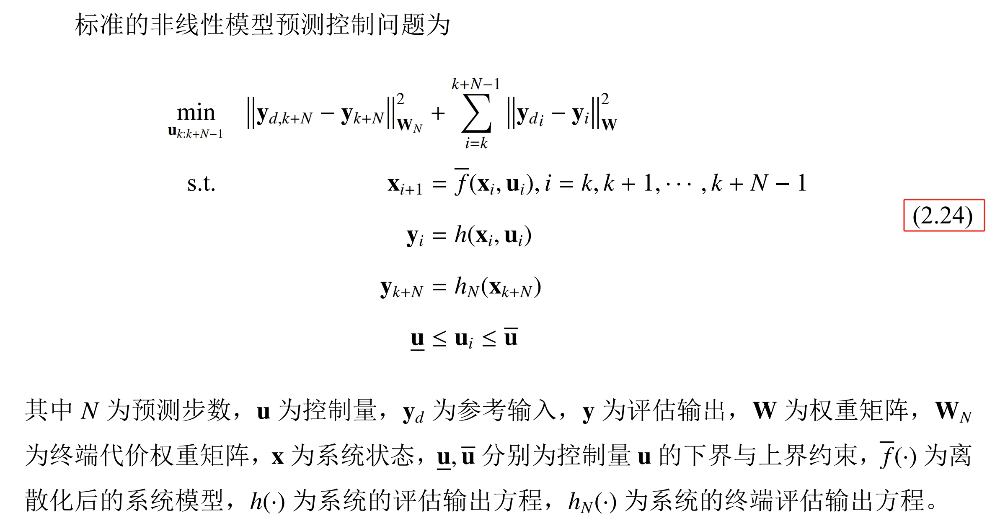
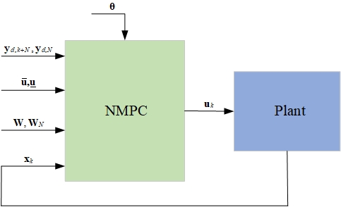

# 0 模型预测控制
模型预测控制（Model Predictive Control，MPC）是一种反馈控制策略[56]，它的基本 思想可以描述为：针对控制对象模型，在某一个采样时刻，利用测量或观测的状态信息， 在线求解并得到一个控制序列，并将该控制序列的第一个控制量作用于控制对象，在下 一个采样时刻循环上述过程，实现滚动优化。因此模型预测控制的基本特征可总结为预 测模型、滚动优化和反馈校正。
1）预测模型
顾名思义，模型预测控制是一种基于模型的控制策略，在控制过程中的控制对象称 为预测模型。模型预测控制是根据系统的当前时刻的信息（系统状态 x(k)）以及下一时刻的控制输入 u(k+1)，来预测未来时刻的系统输出信息x(k+1)，同 时通过将系统输出与系统的参考值的误差优化系统的控制响应，以达到更优的控制效果。 
2）滚动优化
模型预测控制是在有限时域内进行预测的，并不是将目标/代价函数所求出的最优控制序列全部应用于系统控制，而是把采样周期内的最优控制序列的第一个分量作为该时域的控制输入作用于系统，即在该时域内持续滚动优化。滚动优化是在 k 步通过代价 函数得出最优控制序列 U'(k)，将该控制序列的第一个分量 u'(k)作用于模型，在k+1步，系统的初始条件更新为 x(k+1)，此时再将优化求解得到的控制序列U'(k+1) 的第一个分量 u'(k+1)作用于系统，如此重复进行在线优化求解。 
3）反馈校正
为解决由于时变、非线性、干扰等因素导致的预测模型和实际模型之间的失配问题，需要在控制过程中增加反馈校正环节，即把测量或估计出的实际系统输出与预测输出进行对比、优化，进而减少控制误差，提高控制精度。
如图[Fig7.19]所示，在 t_{0} 时刻系统状态为x(0)，基于当前的状态，确定出一个最优的控制 序列和未来时刻相应的状态轨迹（x(0)至\hat{x}(1) 段虚线）。执行最优控制序列第一个元素， 得到 k+1步的系统状态x(1)，该状态可能与预测状态\hat{x}(1) 有差异。重复上述过程，计算最优控制序列和未来的状态轨迹。 
# 1 ACADO简介
ACADO（Automatic Control and Dynamic Optimization）是一款开源的自动控制与动态优化工具包，它提供了一个最优控制问题的优化的基本框架，它可以用于生成高效的最优控制问题求解器，如NMPC，它也提供了MATLAB与C++代码接口，用于嵌入式部署。在RflyPilot中，ACADO主要用于生成NMPC求解器，生成得到的C++代码将被用于Simulink仿真模型中，进行数值仿真。同时，也可以部署到嵌入式系统中，实现在线运行。

参考资料

- [https://acado.github.io/](https://acado.github.io/)
# 2 NMPC问题



系统框图为



# 3 利用ACADO生成NMPC求解器
本小节将介绍如何利用ACADO实现NMPC控制。
## 3.1 ACADO的安装
软件下载
```
git clone https://github.com/acado/acado.git -b stable ACADOtoolkit
```
软件安装
在MATLAB命令行窗口
```
cd ACADOtoolkit/interfaces/matlab/
make clean all
```
注：需要事先安装VS2017等编译环境。首次运行需要进行``make clean all``，后续仅需要运行``make``即可。
## 3.2 动力学方程的获取
利用MATLAB的符号工具箱，可以进行飞行器动力学方程的推导。
利用如下脚本
在RflyPilot的MATLAB工程下``Raspberry_fc_matlab``
运行如下脚本即可得到四旋翼飞行器的动力学方程。
```
syms u1 u2 u3 u4 real; % 定义控制输入
syms vx vy vz q0 q1 q2 q3 wbx wby wbz T1 T2 T3 T4 real; %定义系统状态
syms R h mass K_tau drag_w_x drag_w_y drag_w_z Jxx Jyy Jzz Tm q0d q1d q2d q3d real; %定义系统参数

addpath('mathlib'); % 加载数学库

T_1 = T1;
T_2 = T2;
T_3 = T3;
T_4 = T4;
g = 9.81;
k_air = diag([drag_w_x,drag_w_y,drag_w_z]);
J = diag([Jxx,Jyy,Jzz]);

% dx = zeros(13,1);
wb = [wbx;wby;wbz];

f_1 = [0; 0; -T_1];
f_2 = [0; 0; -T_2];
f_3 = [0; 0; -T_3];
f_4 = [0; 0; -T_4];
l_1 = [R/sqrt(2); R/sqrt(2); -h];
l_2 = [-R/sqrt(2); -R/sqrt(2); -h];
l_3 = [R/sqrt(2); -R/sqrt(2); -h];
l_4 = [-R/sqrt(2); R/sqrt(2); -h];
tau_f1 = cross3(l_1, f_1);
tau_f2 = cross3(l_2, f_2);
tau_f3 = cross3(l_3, f_3);
tau_f4 = cross3(l_4, f_4);

M_1 = [0; 0; K_tau * T_1];
M_2 = [0; 0; K_tau * T_2];
M_3 = [0; 0; K_tau * -T_3];
M_4 = [0; 0; K_tau * -T_4];
% M_1 = 0;
% M_2 = 0;
F = f_1 + f_2 + f_3 + f_4;
M = M_1 + M_2 + M_3 + M_4 + tau_f1 + tau_f2 + tau_f3 + tau_f4;
nQb = [q0; q1; q2; q3];

%% without nQb normlized
%nQb = nQb / norm(nQb);

bCn = nQb2bCn(nQb);
accel_n = bCn * F / mass + [0;0;g];
%accel_b = bCn' * accel_n;
% k_air = diag([k_air_x k_air_y k_air_z]);
angular_accel = M - k_air * (wb)  - skew3(wb) * (J * wb);
%angular_accel = collect(angular_accel);
angular_accel(1) = angular_accel(1) / J(1,1);
angular_accel(2) = angular_accel(2) / J(2,2);
angular_accel(3) = angular_accel(3) / J(3,3);
angular_accel = simplify(angular_accel);
angular_accel = vpa(angular_accel,6)
accel_n = simplify(accel_n);
accel_n = vpa(accel_n,6)
dot_q = simplify(q_dot(wb,nQb));
dot_q = vpa(dot_q,6)
dotT = [u1 - T1;
        u2 - T2;
        u3 - T3;
        u4 - T4] ./ Tm;
dotT = vpa(dotT,6)
```
结果如下
```
angular_accel =

-(0.5*(1.41421*R*T1 - 1.41421*R*T2 - 1.41421*R*T3 + 1.41421*R*T4 + 2.0*drag_w_x*wbx - 2.0*Jyy*wby*wbz + 2.0*Jzz*wby*wbz))/Jxx
-(0.5*(1.41421*R*T2 - 1.41421*R*T1 - 1.41421*R*T3 + 1.41421*R*T4 + 2.0*drag_w_y*wby + 2.0*Jxx*wbx*wbz - 2.0*Jzz*wbx*wbz))/Jyy
                -(1.0*(drag_w_z*wbz - 1.0*K_tau*T1 - 1.0*K_tau*T2 + K_tau*T3 + K_tau*T4 - 1.0*Jxx*wbx*wby + Jyy*wbx*wby))/Jzz

accel_n =
                  -(1.0*(2.0*q0*q2 + 2.0*q1*q3)*(T1 + T2 + T3 + T4))/mass
                       ((2.0*q0*q1 - 2.0*q2*q3)*(T1 + T2 + T3 + T4))/mass
9.81 - (1.0*(T1 + T2 + T3 + T4)*(q0^2 - 1.0*q1^2 - 1.0*q2^2 + q3^2))/mass

dot_q =

- 0.5*q1*wbx - 0.5*q2*wby - 0.5*q3*wbz
  0.5*q0*wbx - 0.5*q3*wby + 0.5*q2*wbz
  0.5*q3*wbx + 0.5*q0*wby - 0.5*q1*wbz
  0.5*q1*wby - 0.5*q2*wbx + 0.5*q0*wbz

dotT =

-(1.0*(T1 - 1.0*u1))/Tm
-(1.0*(T2 - 1.0*u2))/Tm
-(1.0*(T3 - 1.0*u3))/Tm
-(1.0*(T4 - 1.0*u4))/Tm
```
## 3.3 生成求解器
根据已有的动力学方程表达式，可以将其用ACADO语法进行描述，下面提供一个四旋翼NMPC控制器的示例。（对其中的状态进行了删减，并增加了扰动项）

```
clc;
clear all;
close all;
EXPORT_MPC = 1;
EXPORT_SIM = 0;
DifferentialState  vz q0 q1 q2 q3 wbx wby wbz T1 T2 T3 T4;%定义系统状态
Control u1 u2 u3 u4;%定义控制量
OnlineData R h mass K_tau drag_w_x drag_w_y drag_w_z Jxx Jyy Jzz Tm q0d q1d q2d q3d disturbance_f disturbance_p disturbance_q disturbance_r;%定义在线可修改的参数

%IntermediateState q0n q1n q2n q3n T
T = T1 + T2 + T3 + T4;%计算总拉力
q0n = q0;%四元数归一化
q1n = q1;
q2n = q2;
q3n = q3;
% q0n = q0 / sqrt(q0*q0 + q1*q1 + q2*q2 + q3*q3);%四元数归一化
% q1n = q1 / sqrt(q0*q0 + q1*q1 + q2*q2 + q3*q3);
% q2n = q2 / sqrt(q0*q0 + q1*q1 + q2*q2 + q3*q3);
% q3n = q3 / sqrt(q0*q0 + q1*q1 + q2*q2 + q3*q3);
mpc_equ_dynamic = [
dot(vz) == 9.81 - (q0n^2 - q1n^2 - q2n^2 + q3n^2)/mass*(T-disturbance_f);...
%四元数微分方程
dot(q0) == - 0.5*q1n*wbx - 0.5*q2n*wby - 0.5*q3n*wbz;...
dot(q1) == 0.5*q0n*wbx - 0.5*q3n*wby + 0.5*q2n*wbz;...
dot(q2) == 0.5*q3n*wbx + 0.5*q0n*wby - 0.5*q1n*wbz;...
dot(q3) == 0.5*q1n*wby - 0.5*q2n*wbx + 0.5*q0n*wbz;...
%角速度微分方程
dot(wbx) == -(0.0625*(1.41421*T1 - 1.41421*T2 - 1.41421*T3 + 1.41421*T4 + 16.0*drag_w_x*wbx - 16.0*Jyy*wby*wbz + 16.0*Jzz*wby*wbz))/Jxx - disturbance_p/Jxx;...
dot(wby) == -(0.0625*(1.41421*T2 - 1.41421*T1 - 1.41421*T3 + 1.41421*T4 + 16.0*drag_w_y*wby + 16.0*Jxx*wbx*wbz - 16.0*Jzz*wbx*wbz))/Jyy - disturbance_q/Jyy;...
dot(wbz) == -(drag_w_z*wbz - K_tau*T1 - K_tau*T2 + K_tau*T3 + K_tau*T4 - Jxx*wbx*wby + Jyy*wbx*wby)/Jzz - disturbance_r/Jzz;...
%拉力微分方程
dot(T1) == -(T1 - u1)/Tm;...
dot(T2) == -(T2 - u2)/Tm;...
dot(T3) == -(T3 - u3)/Tm;...
dot(T4) == -(T4 - u4)/Tm;...

];

Ts = 0.001;%积分器的步长

% % SIMexport 生成积分器 （用于仿真动力学模型）
acadoSet('problemname', 'sim');
sim = acado.SIMexport( Ts);
sim.setModel(mpc_equ_dynamic);
sim.set( 'INTEGRATOR_TYPE', 'INT_IRK_GL2' );
% sim.set( 'NUM_INTEGRATOR_STEPS', numSteps );
if EXPORT_SIM
mkdir acado_SIM
addpath acado_SIM
cd acado_SIM
sim.exportCode( 'export_SIM' );%导出代码
cd export_SIM
make_acado_integrator('../acado_SIMstep')%生成mex文件
cd ../../
end
%%  MPCexport
%设置mpc输出方程(即公式中的h())
h = [
%n系xy轴 加速度
-((2.0*q0n*q2n + 2.0*q1n*q3n)*(T-disturbance_f))/mass;...
((2.0*q0n*q1n - 2.0*q2n*q3n)*(T-disturbance_f))/mass;...
%n系z轴 速度， 替换原本的加速度
vz;...
% 9.81 - ((T-disturbance_f)*(q0n*q0n - q1n*q1n - q2n*q2n + q3n*q3n))/mass;...
%四元数误差 期望为q0d q1d q2d q3d
%qmul(inv(q),qd)
q0d*q0n + q1d*q1n + q2d*q2n + q3d*q3n;
q1d*q0n - q0d*q1n + q2d*q3n - q3d*q2n;
q2d*q0n - q0d*q2n - q1d*q3n + q3d*q1n;
q1d*q2n - q0d*q3n - q2d*q1n + q3d*q0n;
%输出body系角速度
wbx;wby;wbz;
%输出拉力11-14
T1;...
T2;...
T3;...
T4;...
%输出拉力变化率15-18
-(T1 - u1)/Tm;...
-(T2 - u2)/Tm;...
-(T3 - u3)/Tm;...
-(T4 - u4)/Tm;...
%期望输出19-22
u1;...
u2;...
u3;...
u4;...
];
hN = h(1:14);%终端输出（不能包括控制量）(即公式中的h_N)

acadoSet('problemname', 'mpc');
N = 5;%nmpc预测步长
Ts_mpc = 0.1;%每步预测时长
ocp = acado.OCP( 0.0, N * Ts_mpc, N );
W = acado.BMatrix(eye(length(h)));%定义权重矩阵的维数
WN = acado.BMatrix(eye(length(hN)));
ocp.minimizeLSQ( W ,h);%设置常规输出权重
ocp.minimizeLSQEndTerm( WN, hN );%设置终端项权重

ocp.subjectTo( 0 <= u1 <= 8 );%控制量约束
ocp.subjectTo( 0 <= u2 <= 8 );
ocp.subjectTo( 0 <= u3 <= 8 );
ocp.subjectTo( 0 <= u4 <= 8 );


ocp.setModel(mpc_equ_dynamic);
mpc = acado.OCPexport( ocp );
mpc.set( 'HESSIAN_APPROXIMATION', 'GAUSS_NEWTON' );
mpc.set( 'DISCRETIZATION_TYPE', 'MULTIPLE_SHOOTING' );
mpc.set( 'SPARSE_QP_SOLUTION', 'FULL_CONDENSING_N2');
mpc.set( 'LEVENBERG_MARQUARDT', 1e-5 );
mpc.set( 'INTEGRATOR_TYPE', 'INT_RK4' );
mpc.set( 'QP_SOLVER', 'QP_QPOASES' );
mpc.set('CG_USE_OPENMP',                    0); %并行计算加速      
mpc.set('CG_HARDCODE_CONSTRAINT_VALUES',    0); %动态约束       
mpc.set('CG_USE_VARIABLE_WEIGHTING_MATRIX', 0);       
mpc.set('USE_SINGLE_PRECISION',        0); %float类型

if EXPORT_MPC
mkdir acado_MPC
addpath acado_MPC
cd acado_MPC
mpc.exportCode( 'export_MPC' );%导出代码
global ACADO_;
copyfile([ACADO_.pwd '/../../external_packages/qpoases'], 'export_MPC/qpoases')
cd export_MPC
% make_acado_solver('../acado_MPCstep')%编译生成mex文件
cd ../../
end
```
## 3.4 MATLAB数值仿真

## 3.5 在Simulink中部署
