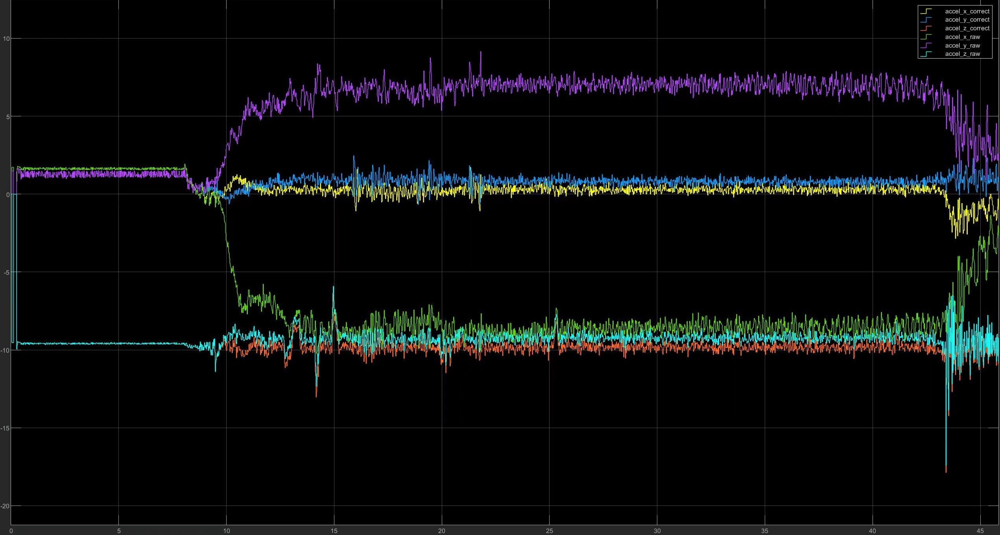

# 其他设置

## 1 ``rflypilot.txt``:``sih_use_real_state``
这个选项是设置在SIH仿真模式下，是否使用真实状态作为控制系统的反馈，当为``1``时，则表示不启用状态估计系统，并直接将模型状态作为反馈输出到控制器中；当为``0``时，则表示启用状态估计系统，所有系统状态由传感器融合得到。

### ``src/application/sih_thread.cpp``
```C
   /* Get model outputs here */
    if(_config.sih_use_real_state)
    {
      // SIH_Model_Y._e_cf_s;
      memcpy(&_cf_msg, &SIH_Model_Y._e_cf_s, sizeof(_cf_msg));
      cf_output_msg.publish(&_cf_msg);
      
      // SIH_Model_Y._e_lpe_s;
      memcpy(&_lpe_msg, &SIH_Model_Y._e_lpe_s, sizeof(_lpe_msg));
      lpe_output_msg.publish(&_lpe_msg);

      lpeLowPass_output_msg.publish(&_lpe_msg);
    }    
```
### ``src/main.cpp``
```C
    case SIH:
      printf("mode : SIH\n");
      start_sih();
      usleep(500000);
      if(!(_config_msg.sih_use_real_state))
      {
        start_attitudeEstimator();
        start_lpe();
      }
      usleep(500000);      
      start_usrController();
    break;
```

## 2 ``rflypilot.txt``:``accel_cutoff_hz``,``gyro_cutoff_hz``

``accel_cutoff_hz``与``gyro_cutoff_hz``分别为加速度计和陀螺仪低通滤波器截止频率，单位Hz。
!!! Warning
    低通滤波器截止频率应小于IMU采样率的1/2。

!!! TIP
    默认使用的低通滤波器为二阶巴特沃斯滤波器，源码位于``src/lib/math_function.h``。
    ```C
    class iir_lpf2_typedef{
    public:
      iir_lpf2_typedef(float sample_freq, float cutoff_freq)
      {
        // set initial parameters
        set_cutoff_frequency(sample_freq, cutoff_freq);
      }
      iir_lpf2_typedef(void)
      {

      }
      // Change filter parameters
      void set_cutoff_frequency(float sample_freq, float cutoff_freq);
      float apply(float sample);
      // Return the cutoff frequency
      float get_cutoff_freq() const { return _cutoff_freq; }
      // Reset the filter state to this value
      float reset(float sample);
    protected:
      float _cutoff_freq;
      float _a1;
      float _a2;
      float _b0;
      float _b1;
      float _b2;
      float _delay_element_1;	// buffered sample -1
      float _delay_element_2;	// buffered sample -2
    };
    ```

## 3 如何支持64位系统
安装编译工具``sudo apt install gcc-aarch64-linux-gnu g++-aarch64-linux-gnu``，修改``CMakeLists.txt``中的``CMAKE_CXX_COMPILER``和``CMAKE_C_COMPILER``配置选项为
```
set(CMAKE_CXX_COMPILER "/usr/bin/aarch64-linux-gnu-g++")
set(CMAKE_C_COMPILER "/usr/bin/aarch64-linux-gnu-gcc")
```

## 4 高性能IMU（ICM45686）的支持

ICM45686是一款高性能IMU，具有低噪声和高量程的特性，现已支持RflyPilot，驱动文件位于``src/drivers/imu/icm45686``，启动函数为``start_icm45686()``。

## 5 飞控非正常姿态安装的设值

对于一些特定情况，可能不能将飞控进行水平安装，比如将飞控竖直安装等，此时需要对IMU和磁力计数据进行旋转处理。RflyPilot支持对物理传感器``ICM42688P``,``ICM45868``,``QMC5883L``三种传感器的旋转。相关配置分别定义在RflyPilot代码驱动文件中。

### src/drivers/imu/accelerometer/PX4Accelerometer.h
```
class PX4Accelerometer
{
public:
	// PX4Accelerometer(uint32_t device_id, enum Rotation rotation = ROTATION_NONE);
	PX4Accelerometer();
	~PX4Accelerometer();

	double theta = 0.0*0.01745329252;
	double phi = 0.0*0.01745329252;
	double psi = 0.0*0.01745329252;

	uint32_t get_device_id() const { return _device_id; }

	int32_t get_max_rate_hz() const { return math_px4::constrain(_imu_gyro_rate_max, static_cast<int32_t>(100), static_cast<int32_t>(4000)); }

	void set_device_id(uint32_t device_id) { _device_id = device_id; }
	// void set_device_type(uint8_t devtype);
	void set_error_count(uint32_t error_count) { _error_count = error_count; }
	void increase_error_count() { _error_count++; }
	void set_range(float range) { _range = range; UpdateClipLimit(); }
	void set_scale(float scale);
	void set_temperature(float temperature) { _temperature = temperature; }

	void update(const hrt_abstime &timestamp_sample, float x, float y, float z);

	void updateFIFO(sensor_accel_fifo_s &sample);
```

### src/drivers/imu/gyroscope/PX4Gyroscope.h
```
class PX4Gyroscope
{
public:
	// PX4Gyroscope(uint32_t device_id, enum Rotation rotation = ROTATION_NONE);
	PX4Gyroscope();
	~PX4Gyroscope();

	double theta = 0.0*0.01745329252;
	double phi = 0.0*0.01745329252;
	double psi = 0.0*0.01745329252;

	uint32_t get_device_id() const { return _device_id; }

	int32_t get_max_rate_hz() const { return math_px4::constrain(_imu_gyro_rate_max, static_cast<int32_t>(100), static_cast<int32_t>(4000)); }

	void set_device_id(uint32_t device_id) { _device_id = device_id; }
	void set_device_type(uint8_t devtype);
	void set_error_count(uint32_t error_count) { _error_count = error_count; }
	void increase_error_count() { _error_count++; }
	void set_range(float range) { _range = range; }
	void set_scale(float scale);
	void set_temperature(float temperature) { _temperature = temperature; }

	void update(const hrt_abstime &timestamp_sample, float x, float y, float z);

	void updateFIFO(sensor_gyro_fifo_s &sample);
```

### src/drivers/magnetometer/qmc5883l/QMC5883L.h
```
class QMC5883L
{
public:
	// QMC5883L(I2CSPIBusOption bus_option, int bus, int bus_frequency, enum Rotation rotation = ROTATION_NONE);
	// ~QMC5883L() override;

	// static I2CSPIDriverBase *instantiate(const BusCLIArguments &cli, const BusInstanceIterator &iterator,
						//  int runtime_instance);
	// static void print_usage();

	double theta = 0*0.01745329252;
	double phi = 0.0*0.01745329252;
	double psi = 0.0*0.01745329252;
	QMC5883L(void);
	void RunImpl();

	int init();
	// void print_status() override;

	int probe();

	bool Configure();

	float magData[3]; 
	uint64_t timestamp[1];
```

!!! TIP
    代码中``theta``,``phi``,``psi``分别对应俯仰、滚转和航向倾角，需要根据实际情况进行调节。设置完成后，强烈建议用户对相应的传感器进行重新校准。


## 6 无刷直驱电机
### 功能的启用
在``main.cpp``中适当位置取消注释``start_servo_motor()``。
!!! TIP
    注：执行器的驱动接口是串口。

### 驱动接口函数
无刷电机使用的类为``servo_motor_typedef``

|函数|说明|参数|
|---|---|---|
|void init(uint8_t _servo_id, char *_port, speed_t speed)|初始化函数|电机id;串口端口;波特率|
|int angle_ctrl(float _angle, float _maxspeed)|角度控制|期望角度;最大转速|
|int speed_ctrl(float _speed)|速度控制|期望速度|
|int iq_ctrl(float _id)|电流控制|期望电流|

## 7 加速度计杆臂补偿
当无人机在高速旋转时，由于IMU安装位置不在飞行器质心，加速度计由于杆臂效应会产较大的加速度计输出，从而使状态估计系统受到影响，进而影响估计精度，加速度计杆臂补偿的目的是为了消除该影响，通过利用遗忘递推最小二乘法对杆臂进行估计，从而得到杆臂值，最后结合角速度输出进行补偿。
相关代码位于``src/lib/imu_offset_estimator``，相关仿真脚本位于``script/imu_offset_estimator_codegen``。
### 如何启用
在``src/drivers/imu/accelerometer/PX4Accelerometer.cpp``中，取消如下注释(约280行)
```
	//注：默认不启用杆臂估计功能，默认使用CH10触发
	// if(_rc_input.channels[9] > 1800)
	// {
	// 	//遗忘因子 lambda 可能与采样率有关系
	// 	imu_offset_estimator_instance.interface(_imu_offset_estimator_data.accel_raw, _gyro.gyro, _imu_offset_estimator_data.imu_offset, 0.9993);
	// }
```
当``CH10``进行触发后，估计器开始工作，此时需要让飞行器保持悬停状态，等待估计器收敛，当收敛后，可以观察到加速度计在水平方向的输出将趋近于0，此时关闭``CH10``即可完成杆臂补偿。
补偿结果如下


