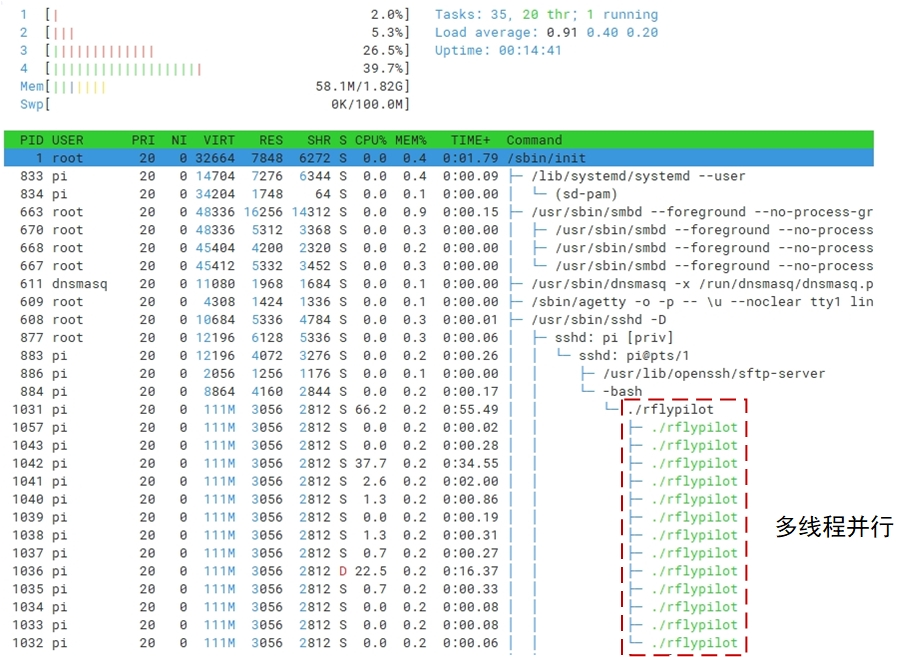
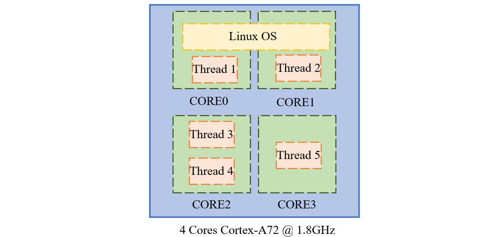
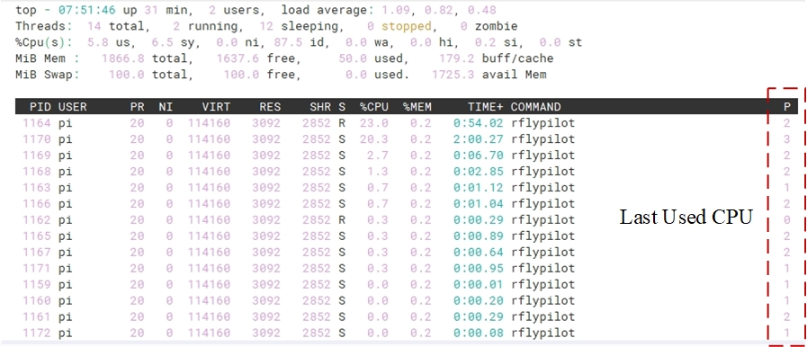
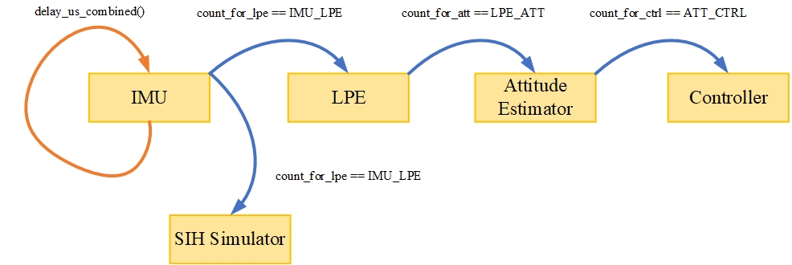
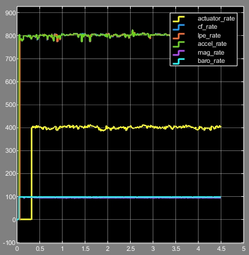

# 飞控系统的实时性
飞控系统的实时性指的是控制器运行频率高低与运行周期稳定性，飞行控制器的实时性是飞行控制的重要保障条件之一。对于传统的基于MCU的飞控方案，由于飞控中运行了嵌入式实时操作系统，飞控程序的实时性可以得到保障。而对于A系列处理器，保障其中飞控程序的实时性要比M系列处理器更加困难。虽然其计算能力有了极大的提高，控制算法可以以较高的频率运行，但是在飞控算法运行周期的稳定性方面，依然存在较大的挑战。

# 实时补丁

RflyPilot飞控系统使用的操作系统是``Navio2``，该系统支持``PREEMPT``补丁，有利于改善飞控系统的实时性。
!!! TIP
    [Navio2的下载地址](https://docs.emlid.com/navio2/configuring-raspberry-pi/)

# 多线程并行

RflyPilot采用了多线程并行的方案，即将飞控任务划分为多个子任务，即线程。得益于树莓派的4核CPU，RflyPilot可以做到多线程并行运行，有效提高了核心任务的运行频率。



# 核心屏蔽与绑定

## 基本原理

**为了最大限度保障核心任务的运行不被打断，RflyPilot对于关键任务采用了核心绑定的操作，并在系统层面屏蔽了该CPU核心的使用，即系统默认不会使用该核心，在启动``rflypilot``后，某些关键任务将会被安排在该核心中运行。**

下图中``Thread 1``与``Thread 2``分别运行于``CORE0``,``CORE1``。``Thread 3``与``Thread 4``运行于``CORE2``,``Thread 5``运行于``CORE3``。其中``Linux OS``运行于``CORE0``与``CORE1``中，它会打断``Thread 1``与``Thread 2``的运行。而``CORE2``与``CORE3``不运行Linux系统，其任务不易被打断，但是``Thread 3``与``Thread 4``容易相互打断。``Thread 5``独享``CORE3``，将具有较高的实时性。



## 运行结果

当飞控程序未运行时，CPU占用情况为


!!! TIP
    RflyPilot默认设置``CORE2``与``CORE3``为被隔离的CPU核心，相关的配置文件为``/boot/cmdline.txt``，``isolcpus=2,3``。
    ```
    dwc_otg.lpm_enable=0 console=tty1 root=/dev/mmcblk0p2 rootfstype=ext4 elevator=deadline fsck.repair=yes rootwait isolcpus=2,3
    ```


飞控实际运行后结果如下


实际绑定情况如下




## 核心绑定设置

关于飞控的核心绑定设置，读者可以参考RflyPilot飞控代码下的``config/configure.h``文件。
```C
/* Estimator Thread Core */
#define ATT_EST_CORE 2
#define POS_EST_CORE 2

/* Sensor Thread Core */
#define IMU_CORE 2
#define MAG_CORE 2
#define BARO_CORE 2
#define GPS_CORE 2

/* Control Thread Core */
#define SUBS_CORE 2
#define BASIC_CTRL_CORE 2
#define CTRL_CORE 3

/* SIH Thread Core */
#define SIH_CORE 2

/* Serve Thread Core */
#define SCREEN_CORE 1
#define CONSOLE_CORE 1
#define LOG_CORE 1
#define ULOG_CORE 1
```

!!! 提示
    如果开发者需要为自己的线程绑定核心可以在线程函数中运行一次``core_bind(x);``，``x``为核心标号（0-3）。

# 线程同步机制

## 优点

线程同步机制的核心目的是让核心线程（如，IMU线程、姿态估计线程、控制器线程）之间的线程间通信延迟最小。以提高系统环路中延迟时间的稳定性，改善系统性能。
!!! TIP
    实验表明，线程同步机制可以极大改善飞行器在高动态下的闭环稳定性。


## 基本原理
RflyPilot中线程同步采用了触发的方式，首先IMU线程以固定频率运行（通过延时函数``delay_us_combined()``），当计数器``count_for_lpe == IMU_LPE``条件成立时，触发``pthread_cond_signal(&cond_imu2lpe)``。而LPE线程运行时会等待``pthread_cond_wait(&cond_imu2lpe, &mutex_imu2lpe)``，直到收到有IMU线程传来的消息才开始执行循环。之后由LPE线程会触发姿态估计线程，最后是控制器线程。



## 基本设置

其配置文件在RflyPilot飞控代码下的``config/configure.h``中。目前RflyPilot只对核心线程启用了该功能。

```C
/* Rate Div */
#define USING_THREAD_SYNC 0
#define IMU_LPE 1
#define LPE_ATT 1
#define ATT_CTRL 2
```
!!! 注意
    <font face="黑体" color=red size=3>默认该功能未启用，为启用线程同步机制，需要将``USING_THREAD_SYNC``设为``1``。``IMU_LPE``/``LPE_ATT``/``ATT_CTRL``为相应的分频系数。</font>

IMU线程的运行频率可以在``rflypilot.txt``文件中进行设置，默认``imu_rate = 800``，即800Hz。

|线程|运行频率(Hz)|
|---|---|
|IMU|800|
|LPE|800/IMU_LPE = 800|
|ATT|800/IMU_LPE/LPE_ATT = 800|
|CTRL|800/IMU_LPE/LPE_ATT/ATT_CTRL = 400|

结果如下




# 代码优化
在代码中，RflyPilot尽量减少了频繁的IO操作，以保障较小的任务耗时。