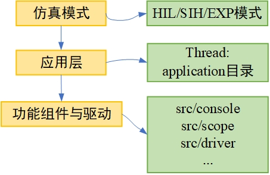

# 开发示例
本小节将给出RflyPilot开发示例。首先介绍RflyPilot飞控目录结构，然后介绍如何为RflyPilot独立的线程，最终给出运行结果。

## 目录结构与软件架构
```
.
├── CMakeLists.txt // cmakelists文件，用于编译
├── basic_controller_codegen // 用于存放基础控制器（目前弃用）
├── build // 编译时的目标目录
├── config // 用于放置配置文件
├── controller_codegen // 用于放置控制器代码生成后的文件
├── estimator_codegen // 用于放置状态估计器代码生成后的文件
├── sih_codegen // 用于放置模型代码生成后的文件
├── src // RflyPilot源码文件
│   ├── 3rdparty // 第三方库文件
│   │   ├── conf-c 
│   │   └── sbus
│   ├── application // 应用层目录，用于存放线程函数
│   ├── calibration // 校准相关代码
│   ├── console // 控制台相关代码
│   ├── drivers // 底层驱动代码
│   │   ├── actuator // 执行器驱动
│   │   │   ├── fpga
│   │   │   └── pca9685
│   │   ├── barometer // 气压计驱动
│   │   │   └── ms5611
│   │   ├── gps // GPS驱动
│   │   ├── imu // IMU 驱动
│   │   │   ├── accelerometer
│   │   │   ├── gyroscope
│   │   │   ├── icm20689 
│   │   │   ├── icm20689new // icm20689驱动，FIFO supported
│   │   │   └── icm42688p
│   │   ├── magnetometer // 磁力计驱动
│   │   │   ├── ist8310
│   │   │   └── qmc5883l
│   │   └── rc //遥控器驱动
│   │       └── sbus
│   ├── include.h // 主头文件
│   ├── lib // 基础功能函数库
│   ├── log // 日志系统相关代码
│   ├── main.cpp // 入口文件
│   ├── msg // 消息系统代码
│   ├── parameter // 参数系统代码
│   ├── scope // 在线示波器代码
│   ├── simulink_utility // simulink相关支持代码
│   └── system_utility //系统级支持代码
├── tools // 脚本文件
│   ├── compile.sh
│   └── upload.sh
```

RflyPilot软件架构如下，RflyPilot飞控软件架构可以分为三层。第一层为仿真模式，包括HIL/SIH/EXP，RflyPilot将由这三种模式确定启动不同的线程组合。第二层应用层由多种线程任务组成，应用层中，每一个小任务都封装为一个线程，可以被独立调用，其对应这``application``中的各个源码文件。第三层为功能与驱动，该层的函数构成了应用层的各个线程。他们由各个功能模块和驱动构成，分散在``src/driver``和``src``下的各个功能文件夹中。



!!! TIP
    如果读者要增加自己的任务``mytask``，可以考虑先在``src``目录中创建相应子文件夹，用于存放相应的功能组件或驱动，然后再在``application``文件夹中创建相应的``mytask_thread.cpp/h``文件，用于构成独立的线程。最后根据运行模式的需要，在``main.cpp``中进行调用即可。

!!! 注意
    RflyPilot中也存在部分线程定义在驱动代码中。

## 开发示例

### 增加功能代码
1. 在``src``中创建文件夹``mytask``，并创建两个文件``mytask.cpp``与``mytask.h``。内容如下

**``mytask.cpp``**

```C
#include "mytask.h"

void my_task_typedef::my_task_init(void)
{
    cnt = 0;
}

void my_task_typedef::my_task_run(void)
{
    cnt++;
    printf("timestamp %f, %d\n", get_time_now() / 1e6, cnt);
}
```

**``mytask.h``**

```C
#ifndef _MY_TASK_
#define _MY_TASK_
#include "include.h"


class my_task_typedef
{
	public:
    uint32_t cnt;
    void my_task_init(void);
    void my_task_run(void);
};


#endif
```
2. 修改``include.h``与``CMakeLists.txt``
在``include.h``的最后一行加入
```C
#include "mytask.h"
```
在``CMakeLists.txt``中，修改``source_file``。
```C
SET(source_file
    src/main.cpp
    src/system_utility/systime.cpp
    src/system_utility/system.cpp
    src/lib/math_function.cpp
    src/msg/msg_def.cpp
    src/calibration/accel_calib.cpp
    src/calibration/gyro_calib.cpp
    src/calibration/mag_calib.cpp
    src/calibration/ellipsoid_method.cpp
    src/calibration/sensor_calibration.cpp
    src/parameter/parameter_read.cpp
    src/scope/scope.cpp
    src/log/binlog.cpp
    src/console/console.cpp
    src/console/screen.cpp
    src/mytask/mytask.cpp
)
```
并在``include_directories``中增加``src/mytask``。
```C
include_directories(
                    config/
                    src
                    src/lib
                    src/calibration
                    ${drivers_include}
                    src/3rdparty/conf-c/include
                    src/simulink_utility
                    src/system_utility
                    src/application
                    src/msg
                    src/parameter
                    src/scope
                    src/console
                    src/log
                    controller_codegen
                    estimator_codegen
                    sih_codegen
                    basic_controller_codegen
                    src/mytask
                    )
```

至此，``mytask``功能模块已被加入到RflyPilot中。
### 增加线程应用
在``src/application``文件夹中创建文件``mytask_thread.cpp/h``
**``mytask_thread.cpp``**
```C
#include "mytask_thread.h"
class my_task_typedef mytask;
void * thread_mytask(void * ptr)
{
    mytask.my_task_init();

    for(;;)
    {
        mytask.my_task_run();
        sleep(1);
    }
}
void start_mytask(void)
{
  bool ret = create_thread("mytask", thread_mytask, NULL);

}
```


**``mytask_thread.h``**

```C
#ifndef _MY_TASK_THREAD_
#define _MY_TASK_THREAD_
#include "include.h"
void * thread_mytask(void * ptr);
void start_mytask(void);
#endif
```
在``include.h``中加入
```C
#include "mytask_thread.h"
```

至此，已将``mytask``作为独立的线程增加至RflyPilot中。

### 新任务的调用

在本示例中，将在EXP模式中对``mytask_thread``进行调用。修改``main.cpp``，增加``start_mytask()``。
```C
    case EXP:
    printf("mode : EXP\n");
      pca9685_dev.pca9685_init(I2C_BUS_1,PWM_FREQ, true);
      pca9685_dev_aux.pca9685_init(I2C_BUS_0,333, true);
      start_icm42688p();    
      start_baro();
      start_gps("/dev/ttySC0");
      start_qmc5883l();
      usleep(500000);
      start_attitudeEstimator();
      start_lpe();
      usleep(500000);
      start_usrController();
      //start_basicController();
      // start_log(NULL);
      start_ulog(NULL);

      start_mytask();
    break;
```

### 运行结果

完成上述步骤后，对RflyPilot进行重新编译，修改仿真模式为EXP，并上传至RflyPilot飞控中，运行``rflypilot``。得到如下输出信息
```
...
mytask thread created with process pid : 1537
mytask starting
...
timestamp 7.645346, 7
timestamp 8.645485, 8
timestamp 9.645568, 9
timestamp 10.645977, 10
timestamp 12.646189, 12
timestamp 13.646284, 13
timestamp 14.646379, 14
timestamp 15.646473, 15
timestamp 16.646567, 16
timestamp 17.646661, 17
timestamp 18.646752, 18
timestamp 19.646845, 19
timestamp 20.646963, 20
timestamp 21.647062, 21
...
```

输出结果说明，新增加的mytask线程正确运行。

