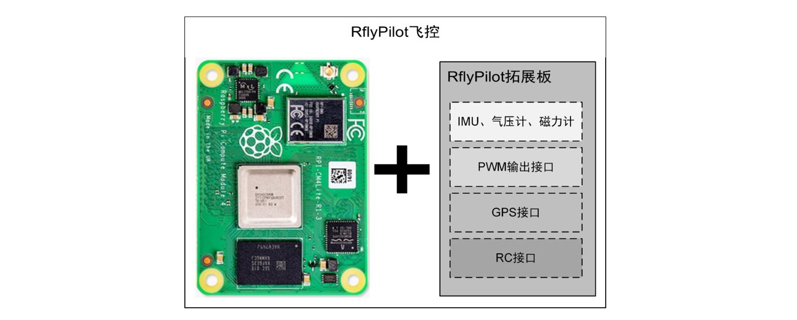
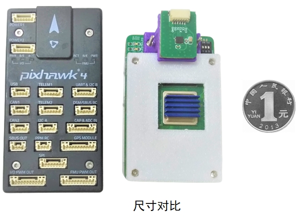
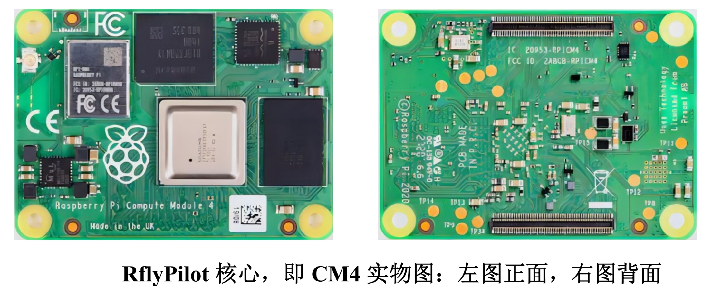
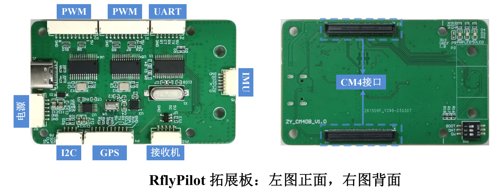
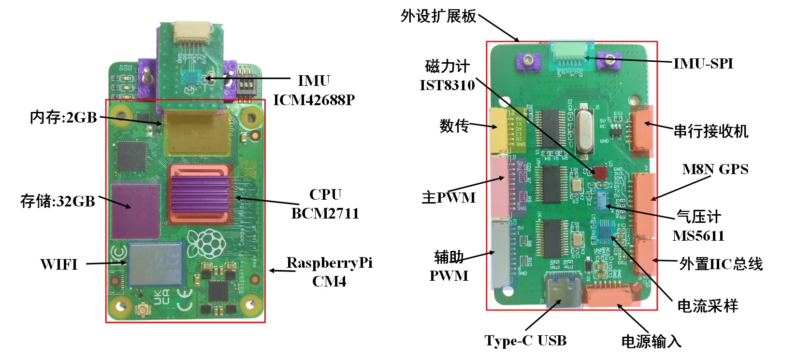

本小结将主要介绍RflyPilot飞控的硬件及软件架构，目的是让读者对RflyPilot有系统性的了解。

# 1 硬件架构
Rflypilot飞控硬件方案的最显著特点就是高性能与“直接采样”，它采用了高性能的ARM处理器，具有4核CPU和1.8GHz主频，在传感器外设上，CPU直接对传感器数据进行读取，并直接发送控制指令。这一点较传统的“上下位机”的硬件方案具有更低的环路延迟，有利于提高系统的性能上限。

RflyPilot飞控硬件主要分为两大部分，树莓派CM4计算板和外设拓展板。树莓派CM4计算板是成品电路板，它较树莓派4B具有更小的体积，它只保留了嵌入式系统核心的处理器、内存、存储芯片等部件，非常适合应用在小型多旋翼的飞控中作计算核心。外设拓展板与树莓派CM4计算板通过两条100pin接口相连接，它主要包含飞控所需的基本传感器（IMU，气压计，磁力计等），同时也配备了连接GPS、电源模块、电调、接收机等飞行器常用设备组件的接口。当然，外设拓展板也配备了电流采样芯片，用于测量动力系统的工作电流。

总体上，外设拓展板的尺寸同树莓派CM4计算板大小一致，在配备丰富的传感器与高性能处理器的同时，兼顾了体积。

## 1.1 树莓派计算版

**关于树莓派CM4计算板的相关介绍可以参考[https://www.raspberrypi.com/documentation/computers/compute-module.html](https://www.raspberrypi.com/documentation/computers/compute-module.html)**

## 1.2 外设扩展板

RflyPilot外设拓展板主要搭载传感器、外部设备接口、电流传感器等，同时在拓展板上也设计了相应的拨码开关，用于修改某些配置选项。值得一提的是，为了更好地使用IMU，RflyPilot的IMU被独立出来，用于开发者增加减震或者其他额外的处理。（比如，在四旋翼飞行器进行旋翼失效的容错实验时，飞行器往往会进入高速的自旋状态，此时的自旋角速度可能会超出陀螺仪的量程，此时通过将陀螺仪倾斜放置是可以增加陀螺仪在某一个方向的量程，进而避免超程问题）

RflyPilot外设拓展板部分传感器布置如下

部分接口配置情况如下

|传感器|总线类型|引脚|
|----|----|----|
|IMU|SPI|CS:BCM8/CLK:BCM11/MOSI:BCM10/MISO:BCM9|
|磁力计QMC5883L|IIC|SCL:BCM3/SDA:BCM2|
|气压计MS5611|IIC|SCL:BCM3/SDA:BCM2|
|PWM0芯片PCA9685|IIC|SCL:BCM3/SDA:BCM2|
|PWM1芯片PCA9685|IIC|SCL:BCM1/SDA:BCM0|
|电流采样ADS1115|IIC|SCL:BCM3/SDA:BCM2|
|接收机|SBUS/iBUS|BCM15|

注意：由于树莓派CM4本身的支持PWM输出的IO数量较少，RflyPilot采用PCA9685芯片实现PWM信号的生成，树莓派CM4通过IIC总线与PCA9685进行通信，生成相应的PWM信号。
# 2 软件架构
RflyPilot软件系统主要分为两大模块，系统功能模块与开发者模块。顾名思义，系统功能模块为RflyPilot提供可靠的底层驱动、系统任务调度、调试接口和线程通信等相关支持，所有代码均由C/C++编写而成。而开发者模块则提供了Simulink的代码生成接口，包括控制器与状态估计系统，这部分的代码可以直接由Simulink代码生成得到，并直接与开发者模块的接口进行对接，大大降低了控制器与状态估计系统部署的时间成本。开发者模块基于MBD的思想，加速了飞行控制和状态估计算法的系统级开发与验证。

总而言之，RflyPilot的特性在于其强大的计算性能、兼备系统级的验证能力与便捷直观的开发方式。

## 2.1 底层驱动
RflyPilot的部分底层驱动参考了PX4相关的驱动代码。总体上，RflyPilot支持常见的传感器，大多数传感器数据采集操作被封装为独立的任务，通过内部消息的形式发布到系统中。

目前RflyPilot支持的传感器如下

|传感器|型号|驱动代码|
|----|----|----|
|IMU|ICM42688p|``src/drivers/imu/icm42688p``|
|IMU|ICM20689|``src/drivers/imu/icm20689``|
|IMU|ICM45686|``src/drivers/imu/icm45686``|
|气压计|MS5611|``src/drivers/barometer/ms5611``|
|磁力计|IST8310|``src/drviers/magnetometer/ist8310``|
|磁力计|QMC5883L|``src/drviers/magnetometer/qmc5883l``|
|接收机|SBUS/iBUS|``src/drviers/rc/sbus``|
|GPS|M8N/M9N|``src/drviers/gps``|
|PWM输出|PCA9685|``src/drviers/actuator/pca9685``|
|UWB|LinkTrack|``src/drivers/uwb``|

## 2.2 任务调度
RflyPilot飞控中各个任务以独立线程（thread）的形式存在，比如IMU采样线程、GPS线程、状态估计线程、控制器线程等。针对不同的验证模式，系统将自动启动不同线程，用以支持系统的运行。树莓派计算板采用的是BCM2711，四核Cortex A72处理器，RflyPilot中部分线程分别绑定到不同的处理器核心上，为保障线程的实时性，个别线程将被绑定到被系统隔离的CPU核心上，并独享该CPU核心，通过这样的方式来降低系统本身和其他线程对该线程的影响。比如控制器线程就是通过这样的方式保障其实时性的。同时为了降低线程间通信的延迟，RflyPilot也引入了一套线程同步机制，用于规定线程运行的先后顺序。值得一提的是，该机制的引入大大提高了状态估计与控制的性能，让系统可以正常工作在高动态的工况。

## 2.3 调试模块
调试模块主要包括日志记录功能、参数读取与在线更新功能、在线示波器功能、控制台功能等。其核心目的是为了方便开发者更好地了解飞行器的飞行状态，同时也提供了控制器、状态估计器的调试接口。所有的在线调试功能均可以通过板载WIFI实现，不需要额外增加数传模块。

## 2.4 通信机制

RflyPilot软件系统内部的线程通信机制主要采用的是共享内存的形式，所有数据以消息形式存储在系统内存中。为避免同时进行消息读取与写入而出现的数据异常情况，这里使用了“原子锁
”进行处理，最终消息的读取``read``与发布``publish``互不冲突，也支持一发多收的通信形式。该消息系统也支持读取历史数据（一段时间），用于避免消息的遗漏，同时该消息系统也支持进行即时的消息记录。

