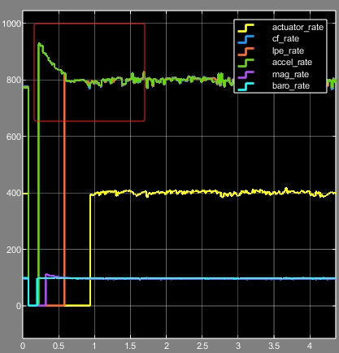

# 任务运行频率
本小节将介绍如何设置不同任务的运行频率。RflyPilot中不同的线程有不同的运行频率，也对运行周期的稳定性有不同的要求，RflyPilot提供了多种运行频率设置方案。相应的配置为``rflypilot.txt``中的``scheduler_mode``。在RflyPilot中，设置运行频率的方案共有三种，分别为**基于线程同步的方法**，**自适应延时**，**Linux系统延时函数**。

|方案|说明|
|---|---|
|线程同步|适用于对线程间有严格时序要求的情况，如控制器、状态估计、IMU|
|自适应延时|适用于需要精确控制运行周期的情况，如磁力计、日志系统等|
|Linux系统延时函数|适用于对运行频率要求不高的情况，如在线示波器等|

# 线程同步

这部分内容请见[系统实时性-线程同步机制](realtime.md)。

# 自适应延时函数
自适应延时函数，顾名思义，该延时函数可以自动调节延时时间，使任务稳定运行在期望频率下。由于任务本身是需要消耗CPU时间的，传统的延时方案很难精确控制任务的运行频率，自适应延时函数通过带前馈的PI控制器，实现自动计算延时时间，进而做到自适应。

该函数定义在``src/system_utility/system.cpp``中。
```C
class adaptive_delay_typedef
{
public:
    timespec _sleep;
    bool initd; 
    double delay_us_feedback;
	double integral;
	double integral_2;
	double kp_output;
	long delay_ns_output; 
	double ff;
	double err;
	float kp;
	float ki;
	uint64_t offset_us;
	uint64_t t0_us;
	uint64_t t1_us;
	uint64_t delay_us_feedback_last;
	float lpf_k;
	bool locked;
	int lock_cnt;
	// offset_us 为程序本身所消耗的时间 单位us
	adaptive_delay_typedef(float _kp, float _ki, uint64_t _offset_us);
	void delay_us(uint64_t us);
	uint64_t calc_delay_us(uint64_t us);
	void delay_freq(uint64_t freq);
	/**** for timestamp sync ***********/
	uint64_t time_sync_accumulated;
	double time_sync_cnt;
	bool time_sync_initd;
	uint64_t time_sync_time0;
	uint64_t time_sync_time;
};
```

## 函数定义与使用
```C
class adaptive_delay_typedef adp_delay(0.5,15,400);//定义对象，kp=0.5，ki=15，offset=400us
void main(void)
{
    for(;;)
    {
        task();//耗时约400us
        adp_delay.delay_us(1000000/800);//单位us
    }
}
```
## IMU线程运行结果
可以观察到IMU频率逐渐稳定在800Hz的拨动曲线。



# Linux系统级延时函数

Linux系统级延时函数为系统库中的延时函数，包括``usleep``，``nanosleep``等，其使用方法这里不再赘述。

# 延时函数的切换
RflyPilot支持对部分线程中延时方法进行切换，设置``rflypilot.txt``中的``scheduler_mode``即可。默认设置为``2``，即自适应延时方案。当开发这想切换到基于线程同步的延时方案是，需要设置``scheduler_mode = 2``并启用``USING_THREAD_SYNC 1``。
```
#system sample rate
imu_rate = 800 
mag_rate = 95 # max rate 100Hz
controller_rate = 333
attitude_est_rate = 500
lpe_rate = 500

#scheduler_mode delay:1 adaptive_delay:2 timer:3(NOT RECOMMENDED!)
scheduler_mode = 2 
```

!!! TIP
    基于线程同步方案的时钟源来自IMU线程，故IMU线程的稳定性影响着其他关键线程。设置``scheduler_mode = 2``则表示IMU线程延时方案为自适应延时方案。