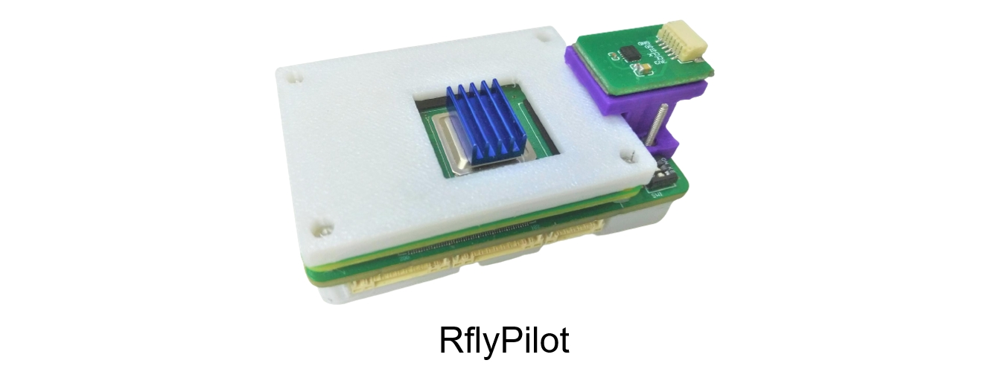

# RflyPilot 简介

RflyPilot是一款由北航[可靠飞行控制组](https://rfly.buaa.edu.cn/)开发的多旋翼无人机自驾仪，即飞控。该飞控硬件的核心是采用Raspberry Pi CM4计算板，较传统的基于微处理器（MCU）的飞控硬件，该飞控具有更强的计算能力，可以运行一些高计算量要求的控制方法，比如非线性模型预测控制（NMPC）。同时RflyPilot采用了极简的拓扑结构，抛弃了常规的多处理方案（一颗处理器主要用于计算，另一个处理器主要用于与传感器、执行器进行通信），而采用单一处理器方案，对信号进行“直接采样”。这样的方案大大简化了飞控的开发，精简了飞控软件架构，也降低了环路延迟，有利于发挥系统的极致性能。飞控软件的开发采用了基于模型设计（Model Based Design, MBD）的思想，可以有效加速开发流程，并有利于做系统级验证。在MBD的思想之下，RflyPilot支持对控制器与状态估计系统的二次开发，同时也提供了丰富的数据记录与调试功能，有利于开发者充分挖掘控制系统的潜能。

为了方便飞控开发，课题组也为RflyPilot编写了一款MATLAB工具箱，叫做RflyPilotTools，该工具箱极大地简化了开发部署流程，如下图所示。

# 特性

1. RflyPilot采用树莓派CM4计算板为核心处理器，具有较强的运算能力，可以实时运行复杂的控制算法，如Nonlinear MPC等；
2. RflyPilot的处理器与传感器和执行器直接通过总线连接，其系统架构更为简单，同时也具有更低的环路延迟；
3. RflyPilot采用基于模型设计（MBD）的设计思想，提供了全链条的仿真验证方案，可以进行MIL、SIH、HIL和实飞实验，其中HIL模式下兼容[RflySim-RT硬件在环实时仿真平台](https://rflybuaa.github.io/RflySimRTDoc/)；
4. 飞控提供了包括控制器、被控对象和状态估计系统的仿真模型框架，利用MATLAB的代码生成功能，可以直接进行数值仿真，并且支持[RflySim3D](http://doc.rflysim.com/)进行视景显示；
5. RflyPilotTools为飞控开发提供了高效的辅助工具，提供“一键代码部署”，“一键编译与上传”等实用功能；
6. 飞控基于Linux系统，底层驱动与系统任务采用高效的C/C++代码编写完成，采用了多种方法以保障飞行系统的实时性；
7. RflyPilot提供了多种开发调试接口，得益于板载WIFI，飞控支持实时数据曲线、在线参数修改、日志记录、远程控制台等功能；
8. 支持交叉编译。

# 仿真验证模式
RflyPilot支持多种仿真验证模式，主要可以分为

|模式代号|模式|说明|
|----|----|----|
|MIL|模型在环（Model in the Loop）|完全基于Simulink的数值仿真，用于早期的数值仿真验证|
|SIH|仿真器在环（Simulator in the Loop）|控制器与模型均运行于RflyPilot飞控中，主要用于验证控制器在硬件系统中的实际表现|
|HIL|硬件在环（Hardware in the Loop）|RflyPilot连接到虚拟被控对象进行仿真，该模式考虑到系统调度、传感器延时等细节，作为实验前的最后一步验证|
|EXP|实验（Experiment）|实飞验证|
|OFFBOARD|上位机模式|用于支持额外计算机自动化指令输入|

**得益于MBD思想，上述各个模式间可以进行快速切换**

### MIL SIH HIL

### 实飞实验

# 推荐人群和应用场景
RflyPilot作为一款小型的高性能飞控，非常适合应用于小型无人机。综合来讲，RflyPilot适合具有一定飞控开发经验的人群，比如从事飞行控制相关的高校学生等，同时开发者还需要熟悉MATLAB/Simulink，并具有一定的Linux使用基础。

RflyPilot适合被应用于传统飞控方案（核心处理器为微处理器）的计算能力不能满足需求的场合，或者需要以基于模型设计(MBD)方式进行飞控开发时，RflyPilot将会是一个很好的选择。

**总而言之，RflyPilot飞控很适合高校学生进行飞行控制研究。**

