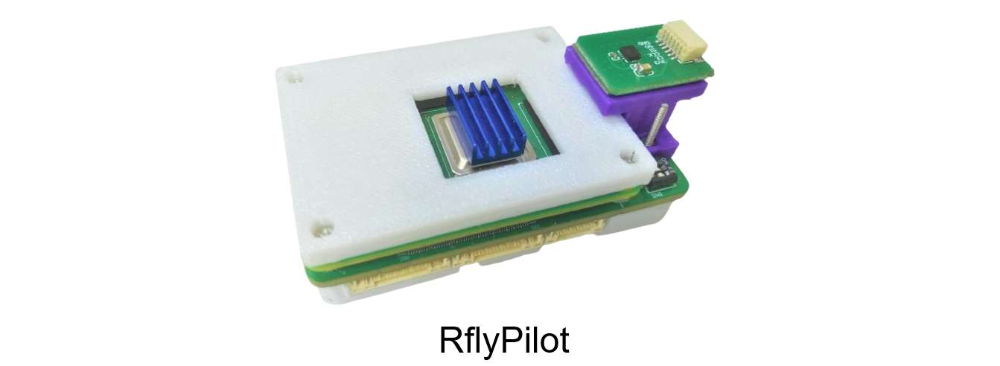
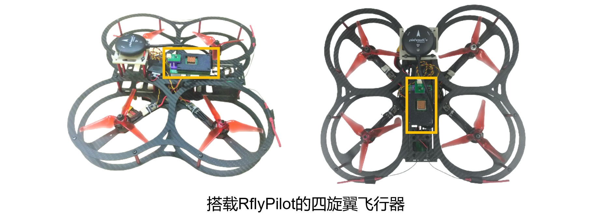
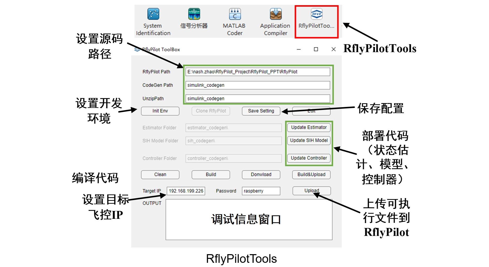
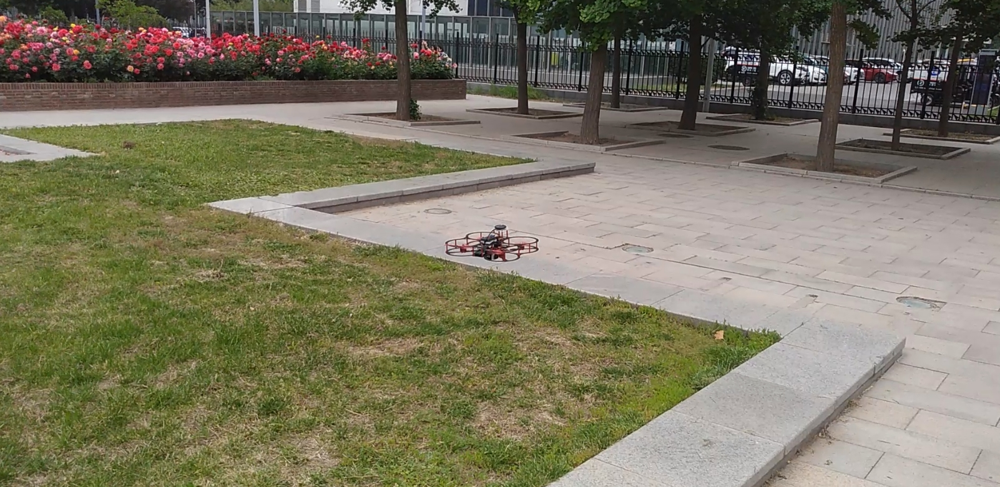

# RflyPilot 简介

RflyPilot是一款由北航可靠飞行控制组开发的多旋翼无人机自驾仪，即飞控。该飞控硬件的核心是采用Raspberry Pi CM4计算板，较传统的基于微处理器（MCU）的飞控硬件，该飞控具有更强的计算能力，可以运行试试运行一些高计算量要求的控制方法，比如非线性模型预测控制（NMPC）。同时RflyPilot采用了极简的拓扑结构，抛弃了常规的多处理方案（一颗处理器主要用于计算，另一个处理器主要用于与传感器、执行器进行通信），而采用单一处理器方案，对信号进行“直接采样”。这样的方案大大简化了飞控的开发，精简了飞控软件架构，也降低了环路延迟，有利于发挥系统的极致性能。飞控软件的开发采用了基于模型设计（Model Based Design, MBD）的思想，可以有效加速开发流程，并有利于做系统级验证。在MBD的思想之下，RflyPilot支持对控制器与状态估计系统的二次开发，同时也提供了丰富的数据记录与调试功能，有利于开发者充分挖掘控制系统的潜能。

为了方便飞控开发，课题组也为RflyPilot编写了一款MATLAB工具箱，叫做RflyPilotTools，该工具箱极大地简化了开发部署流程，如下图所示。

# 仿真验证模式
RflyPilot支持多种仿真验证模式，主要可以分为

|模式代号|模式|说明|
|----|----|----|
|MIL|模型在环（Model in the Loop）|完全基于Simulink的数值仿真，用于早期的数值仿真验证|
|SIH|仿真器在环（Simulator in the Loop）|控制器与模型均运行于RflyPilot飞控中，主要用于验证控制器在硬件系统中的实际表现|
|HIL|硬件在环（Hardware in the Loop）|RflyPilot连接到虚拟被控对象进行仿真，该模式考虑到系统调度、传感器延时等细节，作为实验前的最后一步验证|
|EXP|实验（Experiment）|实飞验证|
|OFFBOARD|上位机模式|用于支持额外计算机自动化指令输入|

**得益于MBD思想，上述各个模式间可以进行快速切换**

### MIL SIH HIL

### 实飞实验

# 下一代RflyPilot
下一代RflyPilot将在硬件配置上进行更新，增加FPGA芯片以至此更高频的电调协议，如OneShot、Dshot等。下一代RflyPilot还将扩展更多的串口，以支持更多的执行器和传感器，如无刷直驱电机、UWB等。同时在电源芯片上，也会进行革新，提供更加稳健的电源方案，以确保飞控的可靠运行。

总而言之，下一代RflyPilot将在硬件支持、可靠性等方面进行改进。
