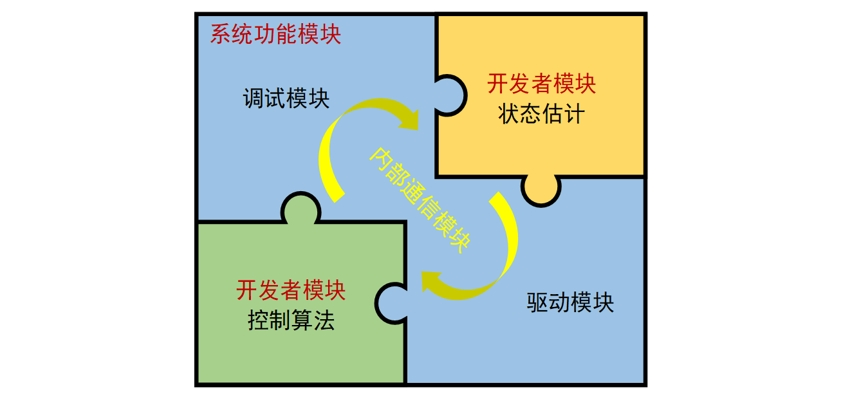

本小结将主要介绍RflyPilot飞控的软件及硬件架构，目的是让读者对RflyPilot有系统性地了解。

# 1 软件架构
RflyPilot软件系统主要分为两大模块，系统功能模块与开发者模块。顾名思义，系统功能模块为RflyPilot提供可靠的底层驱动、系统任务调度、调试接口和线程通信等相关支持，所有代码均由C/C++编写而成。而开发者模块则提供了Simulink的代码生成接口，包括控制器与状态估计系统，这部分的代码可以直接由Simulink代码生成得到，并直接与开发者模块的接口进行对接，大大降低了控制器与状态估计系统部署的时间成本。开发者模块基于MBD的思想，加速了飞行控制和状态估计算法的系统级开发与验证。

总而言之，RflyPilot的特性在于其强大的计算性能、兼备系统级的验证能力与便捷直观的开发方式。

## 1.1 底层驱动
RflyPilot的部分底层驱动参考了PX4相关的驱动代码。总体上，RflyPilot支持常见的传感器，大多数传感器数据采集操作被封装为独立的任务，通过内部消息的形式发布到系统中。

目前RflyPilot支持的传感器如下

|传感器|型号|驱动代码|
|----|----|----|
|IMU|ICM42688p|``src/drivers/imu/icm42688p``|
|IMU|ICM20689|``src/drivers/imu/icm20689``|
|气压计|MS5611|``src/drivers/barometer/ms5611``|
|磁力计|IST8310|``src/drviers/magnetometer/ist8310``|
|磁力计|QMC5883L|``src/drviers/magnetometer/qmc5883l``|
|接收机|SBUS/iBUS|``src/drviers/rc/sbus``|
|GPS|M8N/M9N|``src/drviers/gps``|
|PWM输出|PCA9685|``src/drviers/actuator/pca9685``|
|UWB|LinkTrack|``src/drivers/uwb``|

## 1.2 任务调度
RflyPilot飞控中各个任务以独立线程（thread）的形式存在，比如IMU采样线程、GPS线程、状态估计线程、控制器线程等。针对不同的验证模式，系统将自动启动不同线程，用以支持系统的运行。

## 1.3 调试模块
## 1.4 通信机制

# 硬件架构

