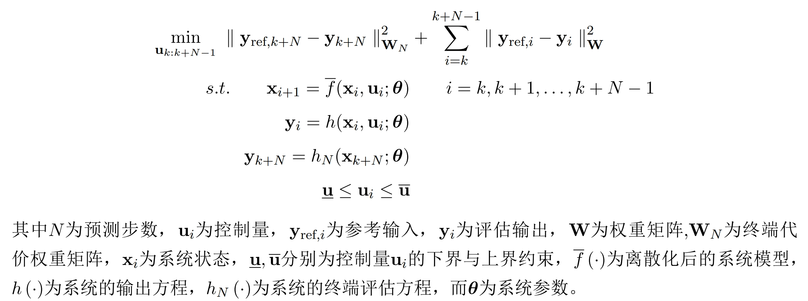
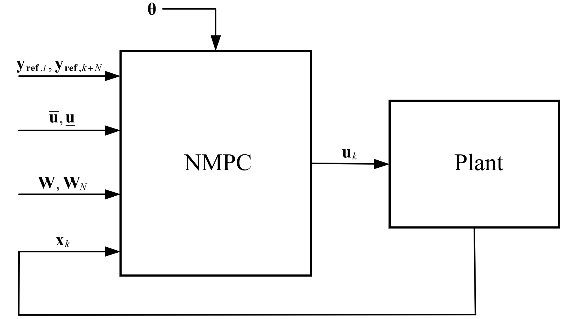

本节将主要介绍如何将非线性模型预测控制应用在RflyPilot飞控中，实现四旋翼的飞行控制。
# 1 模型预测控制
模型预测控制（Model Predictive Control，MPC）是一种反馈控制策略[56]，它的基本思想可以描述为：针对控制对象模型，在某一个采样时刻，利用测量或观测的状态信息， 在线求解并得到一个控制序列，并将该控制序列的第一个控制量作用于控制对象，在下 一个采样时刻循环上述过程，实现滚动优化。因此模型预测控制的基本特征可总结为预 测模型、滚动优化和反馈校正，如图![MPC预测时域]所示。

1）**预测模型**

顾名思义，模型预测控制是一种基于模型的控制策略，在控制过程中的控制对象称 为预测模型。模型预测控制是根据系统的当前时刻的信息（系统状态 x(k)）以及下一时刻的控制输入 u(k+1)，来预测未来时刻的系统输出信息x(k+1)，同 时通过将系统输出与系统的参考值的误差优化系统的控制响应，以达到更优的控制效果。 

2）**滚动优化**

模型预测控制是在有限时域内进行预测的，并不是将目标/代价函数所求出的最优控制序列全部应用于系统控制，而是把采样周期内的最优控制序列的第一个分量作为该时域的控制输入作用于系统，即在该时域内持续滚动优化。滚动优化是在 k 步通过代价 函数得出最优控制序列 U'(k)，将该控制序列的第一个分量 u'(k)作用于模型，在k+1步，系统的初始条件更新为 x(k+1)，此时再将优化求解得到的控制序列U'(k+1) 的第一个分量 u'(k+1)作用于系统，如此重复进行在线优化求解。 

3）**反馈校正**

为解决由于时变、非线性、干扰等因素导致的预测模型和实际模型之间的失配问题，需要在控制过程中增加反馈校正环节，即把测量或估计出的实际系统输出与预测输出进行对比、优化，进而减少控制误差，提高控制精度。
如图下图所示，在 t0 时刻系统状态为x(0)，基于当前的状态，确定出一个最优的控制 序列和未来时刻相应的状态轨迹（x(0)至\hat{x}(1) 段虚线）。执行最优控制序列第一个元素， 得到 k+1步的系统状态x(1)，该状态可能与预测状态\hat{x}(1) 有差异。重复上述过程，计算最优控制序列和未来的状态轨迹。 


***非线性模型预测控制问题的数学描述***

非线性模型预测控制（Nonlinear Model Predictive Control，NMPC）是模型预测控制的一种，它适用于非线性系统，其数学描述可以表示为


系统框图为


从上述系统框图中，一个NMPC求解器需要基本参数，包括反馈状态、参考输入、权重、控制量约束以及系统参数，输出为控制量。

# 2 动力学方程的获取
利用MATLAB的符号工具箱，可以进行飞行器动力学方程的推导。
利用如下脚本
在RflyPilot的MATLAB工程下``Raspberry_fc_matlab``
运行如下脚本即可得到四旋翼飞行器的动力学方程。
```
syms u1 u2 u3 u4 real; % 定义控制输入
syms vx vy vz q0 q1 q2 q3 wbx wby wbz T1 T2 T3 T4 real; %定义系统状态
syms R h mass K_tau drag_w_x drag_w_y drag_w_z Jxx Jyy Jzz Tm q0d q1d q2d q3d disturbance_f disturbance_p disturbance_q disturbance_r real; %定义系统参数

addpath('mathlib'); % 加载数学库

T_1 = T1;
T_2 = T2;
T_3 = T3;
T_4 = T4;
g = 9.81;
k_air = diag([drag_w_x,drag_w_y,drag_w_z]);
J = diag([Jxx,Jyy,Jzz]);

% dx = zeros(13,1);
wb = [wbx;wby;wbz];

f_1 = [0; 0; -T_1];
f_2 = [0; 0; -T_2];
f_3 = [0; 0; -T_3];
f_4 = [0; 0; -T_4];
l_1 = [R/sqrt(2); R/sqrt(2); -h];
l_2 = [-R/sqrt(2); -R/sqrt(2); -h];
l_3 = [R/sqrt(2); -R/sqrt(2); -h];
l_4 = [-R/sqrt(2); R/sqrt(2); -h];
tau_f1 = cross3(l_1, f_1);%计算力矩
tau_f2 = cross3(l_2, f_2);
tau_f3 = cross3(l_3, f_3);
tau_f4 = cross3(l_4, f_4);

M_1 = [0; 0; K_tau * T_1];%计算反扭力矩
M_2 = [0; 0; K_tau * T_2];
M_3 = [0; 0; K_tau * -T_3];
M_4 = [0; 0; K_tau * -T_4];
% M_1 = 0;
% M_2 = 0;
F = f_1 + f_2 + f_3 + f_4 + [0;0;disturbance_f];%计算总拉力（包括扰动）
% 计算总力矩（包括扰动力矩）
M = M_1 + M_2 + M_3 + M_4 + tau_f1 + tau_f2 + tau_f3 + tau_f4 - [disturbance_p; disturbance_p; disturbance_r];
nQb = [q0; q1; q2; q3];

%% without nQb normlized
%nQb = nQb / norm(nQb);

bCn = nQb2bCn(nQb);
accel_n = bCn * F / mass + [0;0;g];
angular_accel = M - k_air * (wb)  - skew3(wb) * (J * wb);
angular_accel(1) = angular_accel(1) / J(1,1);
angular_accel(2) = angular_accel(2) / J(2,2);
angular_accel(3) = angular_accel(3) / J(3,3);
angular_accel = simplify(angular_accel);
angular_accel = vpa(angular_accel,6)
accel_n = simplify(accel_n);
accel_n = vpa(accel_n,6)
dot_q = simplify(q_dot(wb,nQb));
dot_q = vpa(dot_q,6)
dotT = [u1 - T1;
        u2 - T2;
        u3 - T3;
        u4 - T4] ./ Tm;
dotT = vpa(dotT,6)
```
结果如下
```
angular_accel =
 
-(0.5*(2.0*disturbance_p + 1.41421*R*T1 - 1.41421*R*T2 - 1.41421*R*T3 + 1.41421*R*T4 + 2.0*drag_w_x*wbx - 2.0*Jyy*wby*wbz + 2.0*Jzz*wby*wbz))/Jxx
-(0.5*(2.0*disturbance_p - 1.41421*R*T1 + 1.41421*R*T2 - 1.41421*R*T3 + 1.41421*R*T4 + 2.0*drag_w_y*wby + 2.0*Jxx*wbx*wbz - 2.0*Jzz*wbx*wbz))/Jyy
                    -(1.0*(disturbance_r + drag_w_z*wbz - 1.0*K_tau*T1 - 1.0*K_tau*T2 + K_tau*T3 + K_tau*T4 - 1.0*Jxx*wbx*wby + Jyy*wbx*wby))/Jzz

accel_n =
 
                  -(1.0*(2.0*q0*q2 + 2.0*q1*q3)*(T1 + T2 + T3 + T4 - 1.0*disturbance_f))/mass
                       ((2.0*q0*q1 - 2.0*q2*q3)*(T1 + T2 + T3 + T4 - 1.0*disturbance_f))/mass
9.81 - (1.0*(q0^2 - 1.0*q1^2 - 1.0*q2^2 + q3^2)*(T1 + T2 + T3 + T4 - 1.0*disturbance_f))/mass
 
dot_q =
 
- 0.5*q1*wbx - 0.5*q2*wby - 0.5*q3*wbz
  0.5*q0*wbx - 0.5*q3*wby + 0.5*q2*wbz
  0.5*q3*wbx + 0.5*q0*wby - 0.5*q1*wbz
  0.5*q1*wby - 0.5*q2*wbx + 0.5*q0*wbz
 
dotT =
 
-(1.0*(T1 - 1.0*u1))/Tm
-(1.0*(T2 - 1.0*u2))/Tm
-(1.0*(T3 - 1.0*u3))/Tm
-(1.0*(T4 - 1.0*u4))/Tm
```

# 2 ACADO简介
有了以上非线性模型预测控制的理论基础，我们便可以设计出非线性模型预测控制的优化问题。ACADO（Automatic Control and Dynamic Optimization）作为是一款开源的自动控制与动态优化工具包
，它提供了一个最优控制问题的优化的基本框架，它可以用于生成高效的最优控制问题求解器，如NMPC，它也提供了MATLAB与C++代码接口，用于嵌入式部署。

在RflyPilot中，ACADO主要用于生成NMPC求解器，生成得到的C++代码将被用于Simulink仿真模型中，进行数值仿真。同时，也可以部署到嵌入式系统中，实现在线运行。


# 3 利用ACADO生成NMPC求解器
本小节将介绍如何利用ACADO实现NMPC控制。
## 3.1 ACADO的安装
软件下载
```
git clone https://github.com/acado/acado.git -b stable ACADOtoolkit
```
软件安装
在MATLAB命令行窗口
```
cd ACADOtoolkit/interfaces/matlab/
make clean all
```
注：需要事先安装VS2017等编译环境。首次运行需要进行``make clean all``，后续仅需要运行``make``即可。

## 3.2 ACADO语法
|关键词|解释|示例|
|----|----|----|
|DifferentialState|用于定义系统状态量（需要提供其微分方程）|DifferentialState x1 x2 x3|
|Control|用于定义系统的控制量，即要求解的控制输入|Control u1 u2 u3 u4|
|OnlineData|用于定义系统参数等，可以在预测时域中动态修改|OnlineData mass Ixx Iyy Izz|

**生成ACADO求解器步骤**

利用ACADO配置NMPC求解器的基本步骤

1. 定义系统状态、控制输入、在线参数
2. 定义系统微分方程、输出方程、终端输出方程
3. 配置优化问题基本参数
4. 配置优化求解器参数

## 3.3 生成求解器
根据已有的动力学方程表达式，可以将其用ACADO语法进行描述，下面提供一个四旋翼NMPC控制器的脚本示例。

***文件位置：``raspberry_fc_matlab/MIL/quad_make_solver_vz.m``***
```
clc;
clear all;
close all;
EXPORT_MPC = 1;
EXPORT_SIM = 0;
DifferentialState  vz q0 q1 q2 q3 wbx wby wbz T1 T2 T3 T4;%定义系统状态
Control u1 u2 u3 u4;%定义控制量
OnlineData R h mass K_tau drag_w_x drag_w_y drag_w_z Jxx Jyy Jzz Tm q0d q1d q2d q3d disturbance_f disturbance_p disturbance_q disturbance_r;%定义在线可修改的参数

%IntermediateState q0n q1n q2n q3n T
T = T1 + T2 + T3 + T4;%计算总拉力
q0n = q0;%四元数归一化
q1n = q1;
q2n = q2;
q3n = q3;
% q0n = q0 / sqrt(q0*q0 + q1*q1 + q2*q2 + q3*q3);%四元数归一化
% q1n = q1 / sqrt(q0*q0 + q1*q1 + q2*q2 + q3*q3);
% q2n = q2 / sqrt(q0*q0 + q1*q1 + q2*q2 + q3*q3);
% q3n = q3 / sqrt(q0*q0 + q1*q1 + q2*q2 + q3*q3);
mpc_equ_dynamic = [
dot(vz) == 9.81 - (q0n^2 - q1n^2 - q2n^2 + q3n^2)/mass*(T-disturbance_f);...
%四元数微分方程
dot(q0) == - 0.5*q1n*wbx - 0.5*q2n*wby - 0.5*q3n*wbz;...
dot(q1) == 0.5*q0n*wbx - 0.5*q3n*wby + 0.5*q2n*wbz;...
dot(q2) == 0.5*q3n*wbx + 0.5*q0n*wby - 0.5*q1n*wbz;...
dot(q3) == 0.5*q1n*wby - 0.5*q2n*wbx + 0.5*q0n*wbz;...
%角速度微分方程
dot(wbx) == -(0.0625*(1.41421*T1 - 1.41421*T2 - 1.41421*T3 + 1.41421*T4 + 16.0*drag_w_x*wbx - 16.0*Jyy*wby*wbz + 16.0*Jzz*wby*wbz))/Jxx - disturbance_p/Jxx;...
dot(wby) == -(0.0625*(1.41421*T2 - 1.41421*T1 - 1.41421*T3 + 1.41421*T4 + 16.0*drag_w_y*wby + 16.0*Jxx*wbx*wbz - 16.0*Jzz*wbx*wbz))/Jyy - disturbance_q/Jyy;...
dot(wbz) == -(drag_w_z*wbz - K_tau*T1 - K_tau*T2 + K_tau*T3 + K_tau*T4 - Jxx*wbx*wby + Jyy*wbx*wby)/Jzz - disturbance_r/Jzz;...
%拉力微分方程
dot(T1) == -(T1 - u1)/Tm;...
dot(T2) == -(T2 - u2)/Tm;...
dot(T3) == -(T3 - u3)/Tm;...
dot(T4) == -(T4 - u4)/Tm;...

];

Ts = 0.001;%积分器的步长

% % SIMexport 生成积分器 （用于仿真动力学模型）
acadoSet('problemname', 'sim');
sim = acado.SIMexport( Ts);
sim.setModel(mpc_equ_dynamic);
sim.set( 'INTEGRATOR_TYPE', 'INT_IRK_GL2' );
% sim.set( 'NUM_INTEGRATOR_STEPS', numSteps );
if EXPORT_SIM % 这里是生成四旋翼动力学模型的代码，可以暂时不关注这里（如需关注可以查看acado中的example文件夹）
mkdir acado_SIM
addpath acado_SIM
cd acado_SIM
sim.exportCode( 'export_SIM' );%导出代码
cd export_SIM
make_acado_integrator('../acado_SIMstep')%生成mex文件
cd ../../
end
%%  MPCexport
%设置mpc输出方程(即公式中的h())
h = [
%n系xy轴 加速度
-((2.0*q0n*q2n + 2.0*q1n*q3n)*(T-disturbance_f))/mass;...
((2.0*q0n*q1n - 2.0*q2n*q3n)*(T-disturbance_f))/mass;...
%n系z轴 速度， 替换原本的加速度
vz;...
% 9.81 - ((T-disturbance_f)*(q0n*q0n - q1n*q1n - q2n*q2n + q3n*q3n))/mass;...
%四元数误差 期望为q0d q1d q2d q3d
%qmul(inv(q),qd)
q0d*q0n + q1d*q1n + q2d*q2n + q3d*q3n;
q1d*q0n - q0d*q1n + q2d*q3n - q3d*q2n;
q2d*q0n - q0d*q2n - q1d*q3n + q3d*q1n;
q1d*q2n - q0d*q3n - q2d*q1n + q3d*q0n;
%输出body系角速度
wbx;wby;wbz;
%输出拉力11-14
T1;...
T2;...
T3;...
T4;...
%输出拉力变化率15-18
-(T1 - u1)/Tm;...
-(T2 - u2)/Tm;...
-(T3 - u3)/Tm;...
-(T4 - u4)/Tm;...
%期望输出19-22
u1;...
u2;...
u3;...
u4;...
];
hN = h(1:14);%终端输出（不能包括控制量）(即公式中的h_N)

acadoSet('problemname', 'mpc');
N = 5;%nmpc预测步长
Ts_mpc = 0.1;%每步预测时长
%配置MPC问题参数
ocp = acado.OCP( 0.0, N * Ts_mpc, N );
W = acado.BMatrix(eye(length(h)));%定义权重矩阵的维数
WN = acado.BMatrix(eye(length(hN)));
ocp.minimizeLSQ( W ,h);%设置常规输出权重
ocp.minimizeLSQEndTerm( WN, hN );%设置终端项权重

ocp.subjectTo( 0 <= u1 <= 8 );%控制量约束
ocp.subjectTo( 0 <= u2 <= 8 );
ocp.subjectTo( 0 <= u3 <= 8 );
ocp.subjectTo( 0 <= u4 <= 8 );

ocp.setModel(mpc_equ_dynamic);

%配置优化问题设置
mpc = acado.OCPexport( ocp );
mpc.set( 'HESSIAN_APPROXIMATION', 'GAUSS_NEWTON' );
mpc.set( 'DISCRETIZATION_TYPE', 'MULTIPLE_SHOOTING' );
mpc.set( 'SPARSE_QP_SOLUTION', 'FULL_CONDENSING_N2');
mpc.set( 'LEVENBERG_MARQUARDT', 1e-5 );
mpc.set( 'INTEGRATOR_TYPE', 'INT_RK4' );%使用RK4
mpc.set( 'QP_SOLVER', 'QP_QPOASES' );
mpc.set('CG_USE_OPENMP',                    0); %并行计算加速      
mpc.set('CG_HARDCODE_CONSTRAINT_VALUES',    0); %动态约束       
mpc.set('CG_USE_VARIABLE_WEIGHTING_MATRIX', 0);       
mpc.set('USE_SINGLE_PRECISION',        0); %float类型

if EXPORT_MPC %判断是否导出C代码
mkdir acado_MPC
addpath acado_MPC
cd acado_MPC
mpc.exportCode( 'export_MPC' );%导出代码
global ACADO_;
copyfile([ACADO_.pwd '/../../external_packages/qpoases'], 'export_MPC/qpoases')
cd export_MPC
% make_acado_solver('../acado_MPCstep')%编译生成mex文件
cd ../../
end
```
注：该脚本应在工程根目录下运行，``MIL``应以如下方式打开，运行脚本之前应加载ACADO工具箱


运行完成后，将会在工程根目录生成``acado_MPC``文件夹，该文件夹包含刚刚生成求解器源码，需要将该目录及其子文件子文件夹包含到工程路径中。
## 3.4 求解器代码解析
打开``acado_MPC``后，可以看到如下文件


这里可以只关注``acado_common.h``与``test.c``。``test.c``提供了基本的调用示例，求解调用方法可以参考该文件。``acado_common.h``定义了求解器需要用到的变量，这里具体解释一下。
```
/** Number of control/estimation intervals. */
#define ACADO_N 5 //定义预测步数
/** Number of online data values. */
#define ACADO_NOD 19 //定义参数个数 即 onlinedata
/** Number of path constraints. */
#define ACADO_NPAC 0
/** Number of control variables. */
#define ACADO_NU 4 //定义控制量数目，即Control定义的变量个数
/** Number of differential variables. */
#define ACADO_NX 12 //系统状态变量个数
/** Number of algebraic variables. */
#define ACADO_NXA 0
/** Number of differential derivative variables. */
#define ACADO_NXD 0
/** Number of references/measurements per node on the first N nodes. */
#define ACADO_NY 22 //系统参考输入个数
/** Number of references/measurements on the last (N + 1)st node. */
#define ACADO_NYN 14 //系统终端参考输入个数
/** Total number of QP optimization variables. */
#define ACADO_QP_NV 20
/** Number of integration steps per shooting interval. */
#define ACADO_RK_NIS 6
/** Number of Runge-Kutta stages per integration step. */
#define ACADO_RK_NSTAGES 4
/** Providing interface for arrival cost. */
#define ACADO_USE_ARRIVAL_COST 0
/** Indicator for usage of non-hard-coded linear terms in the objective. */
#define ACADO_USE_LINEAR_TERMS 0
/** Indicator for type of fixed weighting matrices. */
#define ACADO_WEIGHTING_MATRICES_TYPE 1


/*
 * Globally used structure definitions
 */

/** The structure containing the user data.
 * 
 *  Via this structure the user "communicates" with the solver code.
 */
typedef struct ACADOvariables_
{
int dummy;
/** Matrix of size: 6 x 12 (row major format)
 * 
 *  Matrix containing 6 differential variable vectors.
 */
real_t x[ 72 ]; //优化问题求解时使用的系统状态序列 长度为（N+1）* NX ，需要进行初始化
/** Matrix of size: 5 x 4 (row major format)
 * 
 *  Matrix containing 5 control variable vectors.
 */
real_t u[ 20 ]; //控制量序列 N * NU ，求解器输出
/** Matrix of size: 6 x 19 (row major format)
 * 
 *  Matrix containing 6 online data vectors.
 */
real_t od[ 114 ]; //参数个数 （N+1）* NOD ， 求解器输入
/** Column vector of size: 110
 * 
 *  Matrix containing 5 reference/measurement vectors of size 22 for first 5 nodes.
 */
real_t y[ 110 ]; // 参考输入个数 NY * N ， 求解器输入
/** Column vector of size: 14
 * 
 *  Reference/measurement vector for the 6. node.
 */
real_t yN[ 14 ]; //终端参考输入 NYN * 1 ， 求解器输入
/** Matrix of size: 22 x 22 (row major format) */
real_t W[ 484 ]; //权重矩阵 NY * NY， 求解器输入
/** Matrix of size: 14 x 14 (row major format) */
real_t WN[ 196 ]; //终端权重矩阵 NYN * NYN， 求解器输入
/** Column vector of size: 12
 * 
 *  Current state feedback vector.
 */
real_t x0[ 12 ]; // 当前系统状态 NX ， 求解器输入，提供当前状态的反馈
/** Column vector of size: 20
 * 
 *  Lower bounds values.
 */
real_t lbValues[ 20 ]; // 控制量约束下界 NU * N ， 求解器输入
/** Column vector of size: 20
 * 
 *  Upper bounds values.
 */
real_t ubValues[ 20 ]; // 控制量约束上届 NU * N， 求解器输入
} ACADOvariables;
```
综上，求解器的输入输出结构可以总结为如下表

|变量|大小|输入输出|
|----|----|----|
|x|(N+1)*NX|初始化时作为输入|
|u|NU*N|求解结果：控制量|输出|
|od|(N+1)*NX|输入|
|y|NY*N|输入|
|yN|NYN|输入|
|W|NY*NY|输入|
|WN|NYN*NYN|输入|
|x0|NX|输入|
|lbValues|NU*N|输入|
|ubValues|NU*N|输入|

## 3.5 Simulink调用求解器的实现原理与部署
在模型``MPCControllerCodeGen_Vz.slx``中，通过使用``S-Function``调用ACADO生成的求解器代码。双击打开该s-function可以得到如下


该文件定义了simulink调用ACADO求解器的接口，接口的衔接通过C语言完成。代码的细节这里不再展示，这里只介绍其中的关键函数
``nmpc_solver_vz_Start_wrapper()``：该函数用于对求解器进行初始化，在该控制器首次运行时，仅调用一次。该函数固化了求解器初值，需要根据实际需求判断相应变量初值，比如系统状态中的四元数的q0，其值一般可设置为1，如果为0，则求解器可能求解出NaN的结果。其中变量的维度也要根据实际需要进行修改，``od``数据也时如此，需要根据实际情况将进行赋值。
``nmpc_solver_vz_Outputs_wrapper()``：该函数用于完成一次问题求解，输入参数包括参考输入，系统当前状态，系统参数，求解器权重，控制量上下界；输出为指令控制量。其输入输出信号维度如下


**注：如需对NMPC问题进行修改，需要根据实际需求对上述端口进行相应调整。如无需修改，这里只需要点击“Build”编译即可，编译完成后，即可完成Simulink对ACADO求解器的部署。**


最终得到的求解器输入输出接口为


编译完成后，将在工程根目录生成``nmpc_solver_vz.mexw64``文件。

## 3.6 MATLAB脚本调用ACADO求解器
具体实现可以参考如下脚本（该脚本实现了一次在预测时域内的预测）
!!! 注意
    **此脚本增加了``make_acado_solver('../mpc_step')``，用于生成可以被直接调用mex文件**

**求解器生成脚本**
```
clc;
clear all;
% close all;
EXPORT = 1;
DifferentialState  vx vy vz q0n q1n q2n q3n wbx wby wbz;%定义系统状态
Control T1x T1y T1z T2x T2y T2z T3x T3y T3z T4x T4y T4z;%定义控制量
OnlineData mass drag_w_x drag_w_y drag_w_z Jxx Jyy Jzz q0d q1d q2d q3d gain_qw gain_qxyz x1 y1 z1 x2 y2 z2 x3 y3 z3 x4 y4 z4 K_tau1 K_tau2 K_tau3 K_tau4;
%IntermediateState q0n q1n q2n q3n T
% q0n = q0 / sqrt(q0*q0 + q1*q1 + q2*q2 + q3*q3);%四元数归一化
% q1n = q1 / sqrt(q0*q0 + q1*q1 + q2*q2 + q3*q3);
% q2n = q2 / sqrt(q0*q0 + q1*q1 + q2*q2 + q3*q3);
% q3n = q3 / sqrt(q0*q0 + q1*q1 + q2*q2 + q3*q3);
mpc_equ_dynamic = [%四元数微分方程
%速度微分方程
dot(vx) == ((2.0*q0n*q2n + 2.0*q1n*q3n)*(T1z + T2z + T3z + T4z) - 1.0*(2.0*q0n*q3n - 2.0*q1n*q2n)*(T1y + T2y + T3y + T4y) + (T1x + T2x + T3x + T4x)*(q0n^2 + q1n^2 - 1.0*q2n^2 - 1.0*q3n^2))/mass;
dot(vy) == ((2.0*q0n*q3n + 2.0*q1n*q2n)*(T1x + T2x + T3x + T4x) - 1.0*(2.0*q0n*q1n - 2.0*q2n*q3n)*(T1z + T2z + T3z + T4z) + (T1y + T2y + T3y + T4y)*(q0n^2 - 1.0*q1n^2 + q2n^2 - 1.0*q3n^2))/mass;
dot(vz) == ((2.0*q0n*q1n + 2.0*q2n*q3n)*(T1y + T2y + T3y + T4y) - 1.0*(2.0*q0n*q2n - 2.0*q1n*q3n)*(T1x + T2x + T3x + T4x) + (T1z + T2z + T3z + T4z)*(q0n^2 - 1.0*q1n^2 - 1.0*q2n^2 + q3n^2))/mass + 9.81;
%姿态微分方程
dot(q0n) == - 0.5*q1n*wbx - 0.5*q2n*wby - 0.5*q3n*wbz - 1.0*gain_qw*q0n*(q0n^2 + q1n^2 + q2n^2 + q3n^2 - 1.0);
dot(q1n) == 0.5*q0n*wbx - 0.5*q3n*wby + 0.5*q2n*wbz - 1.0*gain_qxyz*q1n*(q0n^2 + q1n^2 + q2n^2 + q3n^2 - 1.0);
dot(q2n) == 0.5*q3n*wbx + 0.5*q0n*wby - 0.5*q1n*wbz - 1.0*gain_qxyz*q2n*(q0n^2 + q1n^2 + q2n^2 + q3n^2 - 1.0);
dot(q3n) == 0.5*q1n*wby - 0.5*q2n*wbx + 0.5*q0n*wbz - 1.0*gain_qxyz*q3n*(q0n^2 + q1n^2 + q2n^2 + q3n^2 - 1.0);
%角速度微分方程
dot(wbx) == (T1z*y1 + T2z*y2 + T3z*y3 + T4z*y4 - 1.0*T1y*z1 - 1.0*T2y*z2 - 1.0*T3y*z3 - 1.0*T4y*z4 - 1.0*drag_w_x*wbx + K_tau1*T1x + K_tau2*T2x + K_tau3*T3x + K_tau4*T4x + Jyy*wby*wbz - 1.0*Jzz*wby*wbz)/Jxx;
dot(wby) == (T1x*z1 - 1.0*T2z*x2 - 1.0*T3z*x3 - 1.0*T4z*x4 - 1.0*T1z*x1 + T2x*z2 + T3x*z3 + T4x*z4 - 1.0*drag_w_y*wby + K_tau1*T1y + K_tau2*T2y + K_tau3*T3y + K_tau4*T4y - 1.0*Jxx*wbx*wbz + Jzz*wbx*wbz)/Jyy;
dot(wbz) == (T1y*x1 + T2y*x2 + T3y*x3 + T4y*x4 - 1.0*T1x*y1 - 1.0*T2x*y2 - 1.0*T3x*y3 - 1.0*T4x*y4 - 1.0*drag_w_z*wbz + K_tau1*T1z + K_tau2*T2z + K_tau3*T3z + K_tau4*T4z + Jxx*wbx*wby - 1.0*Jyy*wbx*wby)/Jzz;
];

%%  MPCexport
%设置mpc输出方程
h = [
%n系速度
vx;
vy;
vz;
%
%wbx;wby;wbz;
% relaxed hover solution
(((wbz*(2.0*q0n*q2n + 2.0*q1n*q3n))/mass - (1.0*wby*(2.0*q0n*q3n - 2.0*q1n*q2n))/mass + (wbx*(q0n^2 + q1n^2 - 1.0*q2n^2 - 1.0*q3n^2))/mass)*(wbx*(T1x + T2x + T3x + T4x) + wby*(T1y + T2y + T3y + T4y) + wbz*(T1z + T2z + T3z + T4z)))/(wbx^2 + wby^2 + wbz^2);
(((wbx*(2.0*q0n*q3n + 2.0*q1n*q2n))/mass - (1.0*wbz*(2.0*q0n*q1n - 2.0*q2n*q3n))/mass + (wby*(q0n^2 - 1.0*q1n^2 + q2n^2 - 1.0*q3n^2))/mass)*(wbx*(T1x + T2x + T3x + T4x) + wby*(T1y + T2y + T3y + T4y) + wbz*(T1z + T2z + T3z + T4z)))/(wbx^2 + wby^2 + wbz^2);
(((wby*(2.0*q0n*q1n + 2.0*q2n*q3n))/mass - (1.0*wbx*(2.0*q0n*q2n - 2.0*q1n*q3n))/mass + (wbz*(q0n^2 - 1.0*q1n^2 - 1.0*q2n^2 + q3n^2))/mass)*(wbx*(T1x + T2x + T3x + T4x) + wby*(T1y + T2y + T3y + T4y) + wbz*(T1z + T2z + T3z + T4z)))/(wbx^2 + wby^2 + wbz^2) + 9.81;
%n系加速度
% -(1.0*((2.0*q0n*q2n + 2.0*q1n*q3n)*(T1*cos(alpha1) - 1.0*dfz + T2*cos(alpha2)) - 1.0*(dfx + T1*sin(alpha1) + T2*sin(alpha2))*(q0n^2 + q1n^2 - 1.0*q2n^2 - 1.0*q3n^2) + dfy*(2.0*q0n*q3n - 2.0*q1n*q2n)))/mass;...
% ((2.0*q0n*q1n - 2.0*q2n*q3n)*(T1*cos(alpha1) - 1.0*dfz + T2*cos(alpha2)) + (2.0*q0n*q3n + 2.0*q1n*q2n)*(dfx + T1*sin(alpha1) + T2*sin(alpha2)) + dfy*(q0n^2 - 1.0*q1n^2 + q2n^2 - 1.0*q3n^2))/mass;...
% 9.81 - (1.0*((T1*cos(alpha1) - 1.0*dfz + T2*cos(alpha2))*(q0n^2 - 1.0*q1n^2 - 1.0*q2n^2 + q3n^2) - 1.0*dfy*(2.0*q0n*q1n + 2.0*q2n*q3n) + (2.0*q0n*q2n - 2.0*q1n*q3n)*(dfx + T1*sin(alpha1) + T2*sin(alpha2))))/mass;...
%四元数误差 期望为q0d q1d q2d q3d
%qmul(inv(q),qd)
%q0d*q0n + q1d*q1n + q2d*q2n + q3d*q3n;
% q1d*q0n - q0d*q1n + q2d*q3n - q3d*q2n;
% q2d*q0n - q0d*q2n - q1d*q3n + q3d*q1n;
q1d*q2n - q0d*q3n - q2d*q1n + q3d*q0n;...
% body rate in ned frame
% wbx*(q0n^2 + q1n^2 - q2n^2 - q3n^2) + wby*(2*q0n*q3n + 2*q1n*q2n) - wbz*(2*q0n*q2n - 2*q1n*q3n);...
% wby*(q0n^2 - q1n^2 + q2n^2 - q3n^2) - wbx*(2*q0n*q3n - 2*q1n*q2n) + wbz*(2*q0n*q1n + 2*q2n*q3n);...
% wbz*(q0n^2 - q1n^2 - q2n^2 + q3n^2) + wbx*(2*q0n*q2n + 2*q1n*q3n) - wby*(2*q0n*q1n - 2*q2n*q3n);...
%n系加速度
% -((T1*cos(alpha1) + T2*cos(alpha2))*(2.0*q0n*q2n + 2.0*q1n*q3n) - (T1*sin(alpha1) + T2*sin(alpha2))*(q0n*q0n + q1n*q1n - q2n*q2n - q3n*q3n))/mass;
% ((T1*cos(alpha1) + T2*cos(alpha2))*(2.0*q0n*q1n - 2.0*q2n*q3n) + (2.0*q0n*q3n + 2.0*q1n*q2n)*(T1*sin(alpha1) + T2*sin(alpha2)))/mass;
% 9.81 - (((2.0*q0n*q2n - 2.0*q1n*q3n)*(T1*sin(alpha1) + T2*sin(alpha2)) + (T1*cos(alpha1) + T2*cos(alpha2))*(q0n*q0n - q1n*q1n - q2n*q2n + q3n*q3n)))/mass;
%输出body系角速度
%wbx;wby;wbz;
%输出角加速度
(T1z*y1 + T2z*y2 + T3z*y3 + T4z*y4 - 1.0*T1y*z1 - 1.0*T2y*z2 - 1.0*T3y*z3 - 1.0*T4y*z4 - 1.0*drag_w_x*wbx + K_tau1*T1x + K_tau2*T2x + K_tau3*T3x + K_tau4*T4x + Jyy*wby*wbz - 1.0*Jzz*wby*wbz)/Jxx;
(T1x*z1 - 1.0*T2z*x2 - 1.0*T3z*x3 - 1.0*T4z*x4 - 1.0*T1z*x1 + T2x*z2 + T3x*z3 + T4x*z4 - 1.0*drag_w_y*wby + K_tau1*T1y + K_tau2*T2y + K_tau3*T3y + K_tau4*T4y - 1.0*Jxx*wbx*wbz + Jzz*wbx*wbz)/Jyy;
(T1y*x1 + T2y*x2 + T3y*x3 + T4y*x4 - 1.0*T1x*y1 - 1.0*T2x*y2 - 1.0*T3x*y3 - 1.0*T4x*y4 - 1.0*drag_w_z*wbz + K_tau1*T1z + K_tau2*T2z + K_tau3*T3z + K_tau4*T4z + Jxx*wbx*wby - 1.0*Jyy*wbx*wby)/Jzz;

];
hN = [
%n系速度
vx;
vy;
vz;
%四元数误差 期望为q0d q1d q2d q3d
%qmul(inv(q),qd)
%q0d*q0n + q1d*q1n + q2d*q2n + q3d*q3n;
% q1d*q0n - q0d*q1n + q2d*q3n - q3d*q2n;
% q2d*q0n - q0d*q2n - q1d*q3n + q3d*q1n;
% q1d*q2n - q0d*q3n - q2d*q1n + q3d*q0n;...
%输出body系角速度
% wbx;wby;wbz;
];
acadoSet('problemname', 'mpc');
%1s - 0.05  failed
N = 150;%nmpc预测步长
%比较合适的范围 N= 10~20 Ts = 0.1~0.05
Ts_mpc = 0.05;%每步预测时长
% 10 - 0.05
ocp = acado.OCP( 0.0, N * Ts_mpc, N );
W = acado.BMatrix(eye(length(h)));%定义权重矩阵的维数
WN = acado.BMatrix(eye(length(hN)));
ocp.minimizeLSQ( W ,h);%设置常规输出权重
ocp.minimizeLSQEndTerm( WN, hN );%设置终端项权重

%这是一个四旋翼，但是每一个旋翼都提供三维矢量的力输入

ocp.subjectTo( -15 <= T1x <= 15 );%控制量约束
ocp.subjectTo( -15 <= T1y <= 15 );
ocp.subjectTo( -15 <= T1z <= 15 );

ocp.subjectTo( -15 <= T2x <= 15 );%控制量约束
ocp.subjectTo( -15 <= T2y <= 15 );
ocp.subjectTo( -15 <= T2z <= 15 );

ocp.subjectTo( -15 <= T3x <= 15 );%控制量约束
ocp.subjectTo( -15 <= T3y <= 15 );
ocp.subjectTo( -15 <= T3z <= 15 );

ocp.subjectTo( -15 <= T4x <= 15 );%控制量约束
ocp.subjectTo( -15 <= T4y <= 15 );
ocp.subjectTo( -15 <= T4z <= 15 );

ocp.setModel(mpc_equ_dynamic);
mpc = acado.OCPexport( ocp );
mpc.set( 'HESSIAN_APPROXIMATION', 'GAUSS_NEWTON' );
mpc.set( 'DISCRETIZATION_TYPE', 'MULTIPLE_SHOOTING' );
mpc.set( 'SPARSE_QP_SOLUTION', 'FULL_CONDENSING_N2');
mpc.set( 'LEVENBERG_MARQUARDT', 1e-5 );
mpc.set( 'INTEGRATOR_TYPE', 'INT_RK4' );
mpc.set( 'QP_SOLVER', 'QP_QPOASES' );
mpc.set('CG_USE_OPENMP',                    1); %并行计算加速      
mpc.set('CG_HARDCODE_CONSTRAINT_VALUES',    0); %动态约束       
mpc.set('CG_USE_VARIABLE_WEIGHTING_MATRIX', 0);       
mpc.set('USE_SINGLE_PRECISION',        0); %float类型

if EXPORT
mkdir acado_MPC
addpath acado_MPC
cd acado_MPC
mpc.exportCode( 'export_MPC' );%导出代码
global ACADO_;
copyfile([ACADO_.pwd '/../../external_packages/qpoases'], 'export_MPC/qpoases')
cd export_MPC
make_acado_solver('../mpc_step')%编译生成mex文件
cd ../../
end
```
**运行脚本**
```
clear input;
addpath('../mathlib');
% NOTE
% 增加执行器动态以排除初始状态的影响
% 执行器应该支持双向输入 ±15
%定义权重
%常规项权重均为0
% n系速度 n系加速度 qz_err omega dot_actuator actuator
Weight = [  10 10 1000  0 0 0   0.00001 0.01 0.01 0.01 ];
WeightN = [ 0 0 0 ];
W = diag(Weight);
WN = diag(WeightN);
%N = 50; 此处继承bi_make_solver
%W =diag(zeros(1,17));
%定义系统参数 使用onlinedata
%验证姿态误差的表现情况。欧拉角
x1 = 0.12; y1 = 0.12; z1 = 0;
x2 = -0.12; y2 = -0.12; z2 = 0;
x3 = 0.12; y3 = -0.12; z3 = 0;
x4 = -0.12; y4 = 0.12; z4 = 0;
mass = 0.828;
K_tau1 = 0.00778;
K_tau2 = 0.00778;
K_tau3 = -0.00778;
K_tau4 = -0.00778;

drag_w_x = 0.0032;
drag_w_y = 0.0032;
drag_w_z = 0.0032;
Jxx = 0.0063;%0.0056
Jyy = 0.0063;
Jzz = 0.012;%0.0104;
% 期望姿态为0
q0d = 1; q1d = 0; q2d = 0; q3d = 0;
gain_qw = 10;
gain_qxyz = 10;
% OnlineData mass drag_w_x drag_w_y drag_w_z Jxx Jyy Jzz q0d q1d q2d q3d gain_qw gain_qxyz x1 y1 z1 x2 y2 z2 x3 y3 z3 x4 y4 z4 K_tau1 K_tau2 K_tau3 K_tau4;

od = [mass drag_w_x drag_w_y drag_w_z Jxx Jyy Jzz q0d q1d q2d q3d gain_qw gain_qxyz x1 y1 z1 x2 y2 z2 x3 y3 z3 x4 y4 z4 K_tau1 K_tau2 K_tau3 K_tau4];
%定义初始状态
% vx vy vz q0 q1 q2 q3 wx wy wz
X0 = [0 0 0 1 0 0 0 0 0 -0.1];

%生成onlinedata矩阵 长度为N+1
%N为预测步长
for i=1:N+1
   input.x(i,:) = X0;
    input.od(i,:) = od;   
end
%定义控制量参考输入，这里设置为0
Uref = zeros(N,12);
input.u = Uref;
%定义y reference
y_N = 10;
yN_N = 3;
input.y = zeros(N,y_N);%定义输出y的参考输入
%input.y(:,1) = ones(N,1);
input.yN = zeros(1,yN_N);
% 定义权重
input.W = W;
input.WN = WN;%diag([5e-1 1 2e-3 2e-3]);
%input.shifting.strategy = 1;
%设置控制量约束与仿射约束
u_N = 12;
for i = 1:N
   input.lbValues((i-1)*u_N+1,1)=0;
   input.lbValues((i-1)*u_N+2,1)=0;
   input.lbValues((i-1)*u_N+3,1)=-15;

   input.lbValues((i-1)*u_N+4,1)=0;%单旋翼完全失效
   input.lbValues((i-1)*u_N+5,1)=0;
   input.lbValues((i-1)*u_N+6,1)=0;

   input.lbValues((i-1)*u_N+7,1)=0;
   input.lbValues((i-1)*u_N+8,1)=0;
   input.lbValues((i-1)*u_N+9,1)=-15;

   input.lbValues((i-1)*u_N+10,1)=0;
   input.lbValues((i-1)*u_N+11,1)=0;
   input.lbValues((i-1)*u_N+12,1)=-15;

   input.ubValues((i-1)*u_N+1,1)=0;
   input.ubValues((i-1)*u_N+2,1)=0;
   input.ubValues((i-1)*u_N+3,1)=0;

   input.ubValues((i-1)*u_N+4,1)=0;
   input.ubValues((i-1)*u_N+5,1)=0;
   input.ubValues((i-1)*u_N+6,1)=0;

   input.ubValues((i-1)*u_N+7,1)=0;
   input.ubValues((i-1)*u_N+8,1)=0;
   input.ubValues((i-1)*u_N+9,1)=0;

   input.ubValues((i-1)*u_N+10,1)=0;
   input.ubValues((i-1)*u_N+11,1)=0;
   input.ubValues((i-1)*u_N+12,1)=0;

   %对应 0 <= sqrt(Tx^2 + Ty^2 + Tz^2) <= 16
%    input.lbAValues(i,1) = 1;
%    input.ubAValues(i,1) = 1;
end
input.ctrl = 0;
input.initialization = 0;
input.x0 = X0;
output = mpc_step(input);
output.info
output.x
output.u
u_control = output.u';
% %% 
[m, n] = size(output.x);
x_list = zeros(n,m-1);
x_list(:,1) = X0;

for i = 2:(m-1)
    x_list(:,i) = rk4_integral(x_list(:,i-1), u_control(:,i-1), od, Ts_mpc);
end
% %% 
euler = [];
vel = x_list(1:3,:)';
quat = x_list(4:7,:);
omega = x_list(8:10,:)';

for i = 1:(m-1)
    euler(i,:) = nQb2euler(quat(:,i));
end
t = 0:Ts_mpc:Ts_mpc*(N-1);
subplot(4,1,1)
plot(t,euler,'LineWidth',2);
title('euler');
xlabel('time(s)');
ylabel('angle(rad)');
legend('roll','pitch','yaw');
subplot(4,1,2);
plot(t,omega,'LineWidth',2);
title('omega');
xlabel('time(s)');
ylabel('angular velocity(rad/s)');
legend('\omega_x','\omega_y','\omega_z');
subplot(4,1,3);
plot(t,vel,'LineWidth',2);
title('vel');
xlabel('time(s)');
ylabel('velocity(m/s)');
legend('v_x','v_y','v_z');
subplot(4,1,4);
u_control = u_control';
plot(t,u_control(:,[3,6,9,12]),'LineWidth',2);
title('thrust');
xlabel('time(s)');
ylabel('thrust(N)');
legend('T_1','T_2','T_3','T_4');

% subplot(5,1,4);
% plot(u_control(1:2,:)');
% title('thrust');
% subplot(5,1,5);
% plot(u_control(3:4,:)');
% title('servo');

%% addition functions
function y = rk4_integral(y0,input,param,Ts)
%    y(:,i) = y(:,i-1) + bicopter_ode(y(:,i-1),input,param) * Ts;
k1 = calc_general_state(y0,input,param);
k2 = calc_general_state(y0 + Ts * k1 / 2,input,param);
k3 = calc_general_state(y0 + Ts * k2 / 2,input,param);
k4 = calc_general_state(y0 + Ts * k3,input,param);
y = y0 + (k1 + 2 * k2 + 2 * k3 + k4) * Ts / 6;
end
```
被控对象模型``calc_general_state.m``
```
function x_dot = calc_general_state(x0, u, onlineData)
vx = x0(1,1);
vy = x0(2,1);
vz = x0(3,1);
q0 = x0(4,1);
q1 = x0(5,1);
q2 = x0(6,1);
q3 = x0(7,1);
wbx = x0(8,1);
wby = x0(9,1);
wbz = x0(10,1);

% OnlineData mass drag_w_x drag_w_y drag_w_z Jxx Jyy Jzz q0d q1d q2d q3d gain_qw gain_qxyz x1 y1 z1 x2 y2 z2 x3 y3 z3 x4 y4 z4 K_tau1 K_tau2 K_tau3 K_tau4;


mass = onlineData(1);
drag_w_x = onlineData(2);
drag_w_y = onlineData(3);
drag_w_z = onlineData(4);
Jxx = onlineData(5);
Jyy = onlineData(6);
Jzz = onlineData(7);
q0d = onlineData(8);
q1d = onlineData(9);
q2d = onlineData(10);
q3d = onlineData(11);
gain_qw = onlineData(12);
gain_qxyz = onlineData(13);
x1 = onlineData(14);
y1 = onlineData(15);
z1 = onlineData(16);
x2 = onlineData(17);
y2 = onlineData(18);
z2 = onlineData(19);
x3 = onlineData(20);
y3 = onlineData(21);
z3 = onlineData(22);
x4 = onlineData(23);
y4 = onlineData(24);
z4 = onlineData(25);
K_tau1 = onlineData(26);
K_tau2 = onlineData(27);
K_tau3 = onlineData(28);
K_tau4 = onlineData(29);

q0n = q0 / sqrt(q0*q0 + q1*q1 + q2*q2 + q3*q3);%四元数归一化
q1n = q1 / sqrt(q0*q0 + q1*q1 + q2*q2 + q3*q3);
q2n = q2 / sqrt(q0*q0 + q1*q1 + q2*q2 + q3*q3);
q3n = q3 / sqrt(q0*q0 + q1*q1 + q2*q2 + q3*q3);
% q0n = q0;
% q1n = q1;
% q2n = q2;
% q3n = q3;

T1x = u(1);
T1y = u(2);
T1z = u(3);
T2x = u(4);
T2y = u(5);
T2z = u(6);
T3x = u(7);
T3y = u(8);
T3z = u(9);
T4x = u(10);
T4y = u(11);
T4z = u(12);
x_dot = [
((2.0*q0n*q2n + 2.0*q1n*q3n)*(T1z + T2z + T3z + T4z) - 1.0*(2.0*q0n*q3n - 2.0*q1n*q2n)*(T1y + T2y + T3y + T4y) + (T1x + T2x + T3x + T4x)*(q0n^2 + q1n^2 - 1.0*q2n^2 - 1.0*q3n^2))/mass;
((2.0*q0n*q3n + 2.0*q1n*q2n)*(T1x + T2x + T3x + T4x) - 1.0*(2.0*q0n*q1n - 2.0*q2n*q3n)*(T1z + T2z + T3z + T4z) + (T1y + T2y + T3y + T4y)*(q0n^2 - 1.0*q1n^2 + q2n^2 - 1.0*q3n^2))/mass;
((2.0*q0n*q1n + 2.0*q2n*q3n)*(T1y + T2y + T3y + T4y) - 1.0*(2.0*q0n*q2n - 2.0*q1n*q3n)*(T1x + T2x + T3x + T4x) + (T1z + T2z + T3z + T4z)*(q0n^2 - 1.0*q1n^2 - 1.0*q2n^2 + q3n^2))/mass + 9.81;
%姿态微分方程
- 0.5*q1n*wbx - 0.5*q2n*wby - 0.5*q3n*wbz - 1.0*gain_qw*q0n*(q0n^2 + q1n^2 + q2n^2 + q3n^2 - 1.0);
0.5*q0n*wbx - 0.5*q3n*wby + 0.5*q2n*wbz - 1.0*gain_qxyz*q1n*(q0n^2 + q1n^2 + q2n^2 + q3n^2 - 1.0);
0.5*q3n*wbx + 0.5*q0n*wby - 0.5*q1n*wbz - 1.0*gain_qxyz*q2n*(q0n^2 + q1n^2 + q2n^2 + q3n^2 - 1.0);
0.5*q1n*wby - 0.5*q2n*wbx + 0.5*q0n*wbz - 1.0*gain_qxyz*q3n*(q0n^2 + q1n^2 + q2n^2 + q3n^2 - 1.0);
%角速度微分方程
(T1z*y1 + T2z*y2 + T3z*y3 + T4z*y4 - 1.0*T1y*z1 - 1.0*T2y*z2 - 1.0*T3y*z3 - 1.0*T4y*z4 - 1.0*drag_w_x*wbx + K_tau1*T1x + K_tau2*T2x + K_tau3*T3x + K_tau4*T4x + Jyy*wby*wbz - 1.0*Jzz*wby*wbz)/Jxx;
(T1x*z1 - 1.0*T2z*x2 - 1.0*T3z*x3 - 1.0*T4z*x4 - 1.0*T1z*x1 + T2x*z2 + T3x*z3 + T4x*z4 - 1.0*drag_w_y*wby + K_tau1*T1y + K_tau2*T2y + K_tau3*T3y + K_tau4*T4y - 1.0*Jxx*wbx*wbz + Jzz*wbx*wbz)/Jyy;
(T1y*x1 + T2y*x2 + T3y*x3 + T4y*x4 - 1.0*T1x*y1 - 1.0*T2x*y2 - 1.0*T3x*y3 - 1.0*T4x*y4 - 1.0*drag_w_z*wbz + K_tau1*T1z + K_tau2*T2z + K_tau3*T3z + K_tau4*T4z + Jxx*wbx*wby - 1.0*Jyy*wbx*wby)/Jzz;

];

end
```
# 参考资料

- [https://acado.github.io/](https://acado.github.io/)