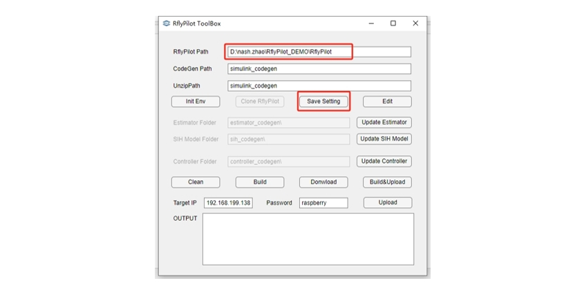

# Quick Start
这部分内容的主要目的是搭建起RflyPilot开发环境
## 0 硬件与软件准备
1. RflyPilot飞控
2. 装有WSL与MATLAB2022B的Windows电脑


## 1 RflyPilot系统配置
### 1.1 树莓派固件准备

RflyPilot使用的操作系统是navio2。

[navio2](https://navio2.hipi.io/)提供的固件(含实时补丁32位),[Download](https://docs.emlid.com/navio2/configuring-raspberry-pi), 可以使用工具[Etcher](https://etcher.io/)安装.

### 1.2 固件下载
RflyPilot采用的是树莓派CM4核心板，与树莓派4B标准版不同，它不包含SD卡槽，核心板上默认装有EMMC存储芯片，所以需要将树莓派固件下载到EMMC中。在树莓派4B中可以用SD卡读卡器对树莓派固件进行下载，将固件写入到SD卡中，对于树莓派CM4而言，由于存储芯片无法拆卸，需要修改树莓派CM4的启动模式，令其在电脑上识别为U盘设备，即可安装常规方法进行固件下载。
#### 1.2.1 树莓派启动模式


|标号|开关|OFF|ON|
|----|----|----|----|
|1|BOOT|从内部存储启动|识别为U盘|
|2|DAT(GPIO25)|飞控程序开机自启*|取消自启|
|3|SW|SBUS协议|IBUS协议|


!!! 注意
	<font face="黑体" color=red size=3>飞控程序开机自启功能目前并未实现</font>

#### 1.2.2 RflyPilot固件下载
1. 首先需要安装驱动程序，[rpiboot](https://github.com/raspberrypi/usbboot/raw/master/win32/rpiboot_setup.exe)，安装完成后运行``rpiboot.exe``，然后将将RflyPilot拨码开关的``BOOT``键拨为``ON``，即识别为U盘。通过USB线连接到电脑。
!!! 注意
	<font face="黑体" color=red size=3>此时不能将飞控连接到飞机上，以免出现信号异常现象</font>

稍等一会儿，便会看到如下界面

最后可以看到新增的两个磁盘

2. 树莓派被识别成U盘后，其系统烧写步骤与SD卡烧写方案无异，这里不再赘述，这里我们默认使用的是**navio2**的系统镜像，该镜像具有实时补丁，可以一定程度提高系统实时性。
### 1.3 系统配置
在固件烧写完成后，还不能直接运行RflyPilot软件程序，需要对系统进行一些配置。如WIFI、SSH、引导程序等。这部分修改可以直接在U盘模式下完成。
#### 1.3.1 配置``/boot/config.txt``
```
[all] 
# enable sc16is752 overlay
dtoverlay=sc16is752-spi1
# enable I2C-1 and set the frequency to 400KHz
# enable spidev0.0
dtparam=spi=on
# enable RC input
enable_uart=1
#init_uart_clock=80000000
#dtoverlay=uart2
#dtoverlay=uart3
#dtoverlay=uart4  ! uart4 conflict with spi0.0
#dtoverlay=uart5
# enable I2C-0
dtparam=i2c_vc=on,i2c_vc_baudrate=1000000
dtparam=i2c_arm=on,i2c_arm_baudrate=1000000
# switch Bluetooth to miniuart
dtoverlay=miniuart-bt
[cm4]
force_turbo=1
core_freq=500
core_freq_min=500
arm_freq=1800
arm_freq_min=1500
start_x=0
# usb otg host mode
dtoverlay=dwc2,dr_mode=host
```
!!! TIP
	这里将usb口设置成了host模式，如需要利用树莓派的USB口给其他设备供电，需要短接飞控板上的D1二极管以保障飞控可以为USB设备供电。
#### 1.3.2 配置``/boot/cmdline.txt``
```
dwc_otg.lpm_enable=0 console=tty1 root=/dev/mmcblk0p2 rootfstype=ext4 elevator=deadline fsck.repair=yes rootwait isolcpus=2,3
```
!!! 注意
	- 这里``isocpus=2,3``的意思是隔离CPU2与CPU3，即系统默认不会使用这两个核心，这两个核心将主要被用于运行飞控系统。当前的树莓派CM4，一共4个CPU核心，分别是CPU0\CPU1\CPU2\CPU3。
	- 如果是Rpi官方系统``root=/dev/mmcblk0p2``的内容可能每次刷固件都是不一样的，也可能和系统版本有关系，笔者这里没有深入了解。
#### 1.3.3 配置``/boot/wpa_supplication.conf``
```
country=CN
ctrl_interface=DIR=/var/run/wpa_supplicant GROUP=netdev
update_config=1
network={
	ssid="xxx"
	psk="XXXXXXXX"
}
```
!!! TIP
	此处为WIFI设置，需要根据实际情况进行配置，RflyPilot将在系统启动时连接该WIFI。

#### 1.3.4 配置SSH
在``boot``目录下创建一个空文件，文件名取为``ssh``即可，此时系统将默认在开始时启动SSH服务。

至此，便完成了RflyPilot飞控操作系统的基本配置。
!!! 注意
	配置完成后，应将``BOOT``开关拨回``OFF``，以从内部存储启动系统。

#### 1.4 树莓派操作系统的使用
本小节主要介绍树莓派操作系统的基本使用方法与常用指令。
树莓派上电之后等待一会，这个过程中，飞控的黄色指示灯(ACTION)会闪烁，表示系统正在执行某些任务。最终两颗红色LED会常亮，表示系统启动完成。此时通过SSH即可连接到树莓派系统。这里使用``WindTerm``作为终端软件进行SSH连接（需要树莓派自动连接WIFI）。值得一提的是，由于树莓派系统资源有限，这里直接使用基于命令行的方式进行了交互，以减低系统自身的消耗。

!!! TIP
	- 默认用户名：``pi``
	- 默认密码：``raspberry``


常通过``htop``指令去查看系统资源使用情况，如下图所示，可以看到CPU3\CPU4并没有被系统所使用，占用率为0


常用命令还有：df ifconfig cp rm ls free top netstat vim


## 2 Windows环境配置
对于Windows的环境要求如下

1. 首先确认开启了**适用于Windows的Linux子系统功能**
2. 通过Windows应用商店安装WSL ubuntu18.04版本. 
3. 安装后打开, 等待配置后到提示输入用户名的阶段时不要输入用户名直接关闭ubuntu 18.04的终端.
4. 安装Virtual Studio 2017用于代码生成
5. 安装MATLAB 2022b

!!! TIP
	这里使用WSL子系统的主要目的是用于[交叉编译](https://baike.baidu.com/item/%E4%BA%A4%E5%8F%89%E7%BC%96%E8%AF%91/10916911)，这里主要考虑到，飞控代码在树莓派机载端直接编译会非常慢，而通过Linux系统计算机编译会快很多。为了提高开发效率，RflyPilot选择使用交叉编译的方式在Linux端直接编译得到可以用在树莓派端执行的可执行文件。
### 2.1 WSL环境配置
进入WSL后，执行命令
```
sudo apt install cmake
sudo apt install gcc-arm-linux-gnueabihf
sudo apt install g++-arm-linux-gnueabihf
sudo apt install sshpass
```

### 2.2 RflyPilot源码下载
RflyPilot的源码主要分为两大部分：RflyPilot飞控系统接口（C++代码）与用于飞控设计的模型文件(MATLAB)。

RflyPilot源码: [https://gitee.com/RflyBUAA/RflyPilot.git](https://gitee.com/RflyBUAA/RflyPilot.git)

RflyPilot MATLAB源码: [https://gitee.com/RflyBUAA/RflyPilot_Model.git](https://gitee.com/RflyBUAA/RflyPilot_Model.git)

使用命令
```
git clone https://gitee.com/RflyBUAA/RflyPilot.git
git clone https://gitee.com/RflyBUAA/RflyPilot_Model.git
```

RflyPilot飞控系统接口采用高效的C++代码完成，为RflyPilot提供基本的飞控功能，包括传感器读取任务、执行器输出任务、控制器与状态估计接口、日志系统、传感器校准模块等等。在常规的飞控算法设计过程中，一般不需要修改这部分的代码。

飞控模型文件主要包含控制器模型、无人机模型、状态估计器模型等。这部分模型可以直接进行数值仿真，用于前期的控制系统验证。设计好的飞控可以进行代码生成，进而嵌入到RflyPilot飞控系统中。这部分内容是开发者需要经常修改调试的内容。值得一提的是，为了更好地处理代码迁移与编译的问题，课题组也针对性地开发了一套工具——RflyPilotTools，用于简化复杂的操作流程。

由于MATLAB模型中还未包含状态估计模型和无人机模型，还需要执行子模块更新指令，方可完成对模型的完整下载。
```
cd RflyPilot_Model
git submodule update --init --recursive
cd Estimator
git checkout master
cd ../Model
git checkout master
cd ..
```
### 2.3 文件组织结构

```
.
├── Estimator
│   ├── AttitudeEstimator.slx（姿态估计仿真模型）
│   ├── AttitudeEstimatorParameters.m（姿态估计器的参数初始化脚本）
│   ├── Estimator.sldd（用于存储估计器参数）
│   ├── Inteface.sldd（代码生成的接口定义文件）
│   ├── PositionEstimator.slx（位置估计器模型）
│   ├── PositionEstimatorParameters.m（位置估计器的参数初始化脚本）
│   ├── README.md
│   ├── doc
│   │   └── estimatordoc.tex（状态估计的说明文档）
├── MATLABApp
│   └── RflyPilotToolBox.mlappinstall（RflyPilot安装包）
├── MIL
│   ├── ControlInit_vz.m（控制器初始化脚本）
│   ├── MPCControllerCodeGen_Vz.slx（四旋翼NMPC控制器模型）
│   ├── MPC_HIL.slx（综合仿真模型）
│   ├── README.txt
│   ├── SIH_Model.slx（SIH仿真模型）
│   ├── quad_make_solver_vz.m（用于生成四旋翼NMPC求解器）
│   └── usrController.slx（用于代码生成的控制器模型）
├── Model
│   ├── H250Model.slx（四旋翼模型文件）
│   ├── ModelParam_H2504S.m（四旋翼模型参数初始化文件）
├── RflyPilot_Model.prj（工程文件）
├── cache
├── debug_tools（用于存放RflyPilot的在线示波器）
├── i2c2pwm
├── log_analysis（用于log存储与分析的文件）
├── mathlib（数学库）
├── nmpc_solver_vz.cpp（nmpc求解器相关文件）
├── nmpc_solver_vz.tlc（nmpc求解器相关文件）
├── nmpc_solver_vz_wrapper.cpp（nmpc求解器相关文件）
├── resources (Simulink工程缓存文件)
├── simulink_codegen（代码生成的目标文件夹）
└── swfiles（RflyPilot飞控外壳3D打印文件）
```

## 3 模型的运行(MIL)
本小节将介绍如何运行数值仿真，即模型在环仿真。
### 3.1 仿真参数初始化
首先在MATLAB中打开工程文件``RflyPilot_Model.prj``，然后分别运行如下脚本

- MIL/ControlInit_vz.m
- Estimator/AttitudeEstimatorParameters.m
- Estimator/PositionEstimatorParameters.m
- Model/ModelParam_H2504S.m

!!! 注意
	<font face="黑体" color=red size=3>为避免后续仿真过程中文件路径发生错误等问题**强烈**建议在后续进行仿真的过程中，工作目录依然保持在工程根目录下，即``RflyPilot_Model``目录下。</font>


### 3.2 综合仿真

打开MIL/MIL_HIL.slx模型


这是综合仿真模型，它整合了遥控器输入接口，控制器，无人机模型，状态估计器以及3D显示输出模块，是一个较为全面的仿真模型。这里的控制器与无人机模型部分均使用了Simulink的ModelReferance功能(类似与函数调用)，通过规范化模型输入输出接口，调用相应的子模型，如，控制器模型调用了``MPCControllerCodeGen.slx``，而无人机模型则调用了``H250Model.slx``，状态估计系统则在内部分别调用了``AttitudeEstimator``与``PostionEstimator``。如下图所示。


在部署完[NMPC求解器](../mpc/mpc_example.md)后，可以在工程根目录下生成``nmpc_solver_vz.mexw64``。可以直接运行综合仿真模型，并打开``RflySim3D``，进行位姿显示。默认模型采用Dashboard进行指令输入，如下图所示（在Viewer中）。


!!! 注意
	<font face="黑体" color=red size=3>需要保证NMPC求解器源码文件夹``acado_MPC``在工程根目录下，同时确保其已经加载到工程索引路径中。</font>

## 4 代码生成
在进行数值仿真之后，我们已经对系统的性能有了一个基本的判断。可以进行下一步的验证工作，包括HIL(半物理仿真)、SIH(硬件仿真)、EXP(实飞实验)。然而这些验证模式都需要将仿真程序转化为可以进行实际部署的形式，所以将这些模型进行代码生成则是一条必经之路。
### 4.1 控制器代码生成
打开``MIL/usrController.slx``模型，可以看到（下图）其中左侧为模型输入接口，其均为结构体类型，其中包含多种数据，模型右侧为PWM信号输出接口与调试数据输出接口。其中右侧对话框中的外部数据用于加载接口定义文件``Interface.sldd``。这个文件定义的接口与RflyPilot飞控中的C++代码接口一致，是沟通代码生成与RflyPilot基础系统的桥梁。同时这个模型是将原有``MPCControllerCodeGen_Vz.slx``进行了封装，这样的处理方法有利于代码生成后接口的兼容，也有助于进行控制模型的快速切换与部署。


在上述设置完成之后，即可对该控制器模型进行代码生成。进入APP下的Embedded Code工具箱，选择进行**编译**。

!!! TIP
	代码生成过程中可能会遇到错误，可以尝试将acado_MPC文件夹下的文件进行重新加载，或尝试清除``cache``和``simulink_codegen``文件夹下的内容后重新生成。


最终可以得到如下界面。


### 4.2 状态估计代码生成
状态估计部分的代码生成分为姿态估计器代码生成与位置估计代码生成。首先介绍姿态估计代码生成，打开``Estimator/AttitudeEstimator.slx``模型，如下图所示。其代码生成步骤与控制器代码生成步骤类似，这里不再赘述。

除了姿态信息，位置信息也不可或缺。位置估计器的模型为``Estimator/PositionEstimator.slx``，位置估计模型的代码生成步骤与姿态估计模型类似，这里同样不再赘述。

!!! TIP
	关于状态估计系统的相关介绍，感兴趣的读者可以参考PX4的Q_estimator和LPE。

### 4.3 无人机模型代码生成
至此，控制器、状态估计器的模型均已被生成为代码的形式，无人机的仿真模型同样可以进行代码生成，这里主要用作SIH仿真中的被控对象，即只需要一共飞控硬件尽可以进行飞行仿真，这种仿真模式主要用于验证控制器在实际飞控平台中的运行是否正常。
打开模型``SIH_Model.slx``，这里同样使用了参考模型的模型搭建方式，使用的模型是``Model/H250Model2.slx``（与数值仿真模型``Model/H250Model.slx``的区别详见``Model/README.md``），使用的接口文件同样是``Interface.sldd``，其代码生成方式也不再赘述了。


!!! TIP
	在生成过程中可能遇到如下报错，直接点击“修复”即可。

## 5 代码的部署编译与RflyPilot
### 5.1 代码部署
将四大功能模块进行代码生成后，可以得到如下结果，在``simulink_codegen``文件夹下。可以看到生成的代码已被打包为zip文件。


如何将其生成的代码部署到实际飞控中呢？此时就需要通过RflyPilotTools进行衔接。


RflyPilotTools是一款基于MATLAB的工具箱，它的安装包位于``MATLABApp/RflyPilotToolBox.mlappinstall``，在工程根目录下，双击即可安装，最终会显示在MATLAB工具箱界面中。


首次使用RflyPilotTool需要对其进行配置，主要配置选项为``RflyPilot Path``，即RflyPilot源码的路径，至于``CodeGen Path``与``Unzip Path``则分别为代码生成源码的路径和生成压缩包的路径，这里保持默认即可。配置完成后，点击“Save Setting”，即可保持配置到工程根目录下的``rflypilottoolbox.mat``中。



配置完成后，依次点击“Update Estimator” “Update SIH Model” “Update Controller"即可做到“一键部署”，即将代码复制到相应的源码文件夹中。与之对应的文件夹分别为``estimator_codegen``,``sih_codegen``,``controller_codegen``。在更新完成后，读者可以在自行去相应的文件夹查看相应的源码。
### 5.2 RflyPilot编译
RflyPilot的交叉编译是在WSL系统中进行的。但得益于RflyPilotTool，这个步骤被进一步简化。
首先在RflyPilot源码文件夹中创建``build``文件夹，用于存储编译后的文件。然后在RflyPilotTool中，点击“Build”，即可进行交叉编译。编译过程中的输出可以在MATLAB命令行中查看。
输出结果为

```
-- Configuring done
-- Generating done
-- Build files have been written to: /mnt/d/nash.zhao/RflyPilot_DEMO/RflyPilot/build
[ 14%] Built target confc
[ 20%] Built target controller_codegen
[ 27%] Built target basic_controller_codegen
[ 31%] Built target libsbus
[ 40%] Built target estimator_codegen
[ 55%] Built target sih_codegen
Scanning dependencies of target rflypilot
[ 56%] Building CXX object CMakeFiles/rflypilot.dir/src/application/attitudeEstimator_thread.cpp.o
[ 57%] Building CXX object CMakeFiles/rflypilot.dir/src/application/ulog_thread.cpp.o
[ 57%] Building CXX object CMakeFiles/rflypilot.dir/src/application/usrController_thread.cpp.o
[ 58%] Building CXX object CMakeFiles/rflypilot.dir/src/simulink_utility/norm_afMWvhHe.cpp.o
[ 59%] Building CXX object CMakeFiles/rflypilot.dir/src/application/system_app.cpp.o
[ 60%] Building CXX object CMakeFiles/rflypilot.dir/src/simulink_utility/norm_a2pQkYtO.cpp.o
[ 61%] Building CXX object CMakeFiles/rflypilot.dir/src/simulink_utility/rtGetInf.cpp.o
[ 62%] Building CXX object CMakeFiles/rflypilot.dir/src/simulink_utility/rtGetNaN.cpp.o
[ 63%] Building CXX object CMakeFiles/rflypilot.dir/src/simulink_utility/rt_atan2d_snf.cpp.o
[ 63%] Building CXX object CMakeFiles/rflypilot.dir/src/simulink_utility/rt_atan2f_snf.cpp.o
[ 64%] Building CXX object CMakeFiles/rflypilot.dir/src/simulink_utility/rt_nonfinite.cpp.o
[ 65%] Building CXX object CMakeFiles/rflypilot.dir/src/simulink_utility/rt_r32zcfcn.cpp.o
[ 66%] Building CXX object CMakeFiles/rflypilot.dir/src/simulink_utility/rt_zcfcn.cpp.o
[ 67%] Building CXX object CMakeFiles/rflypilot.dir/src/drivers/px4lib/test_time.cpp.o
[ 68%] Building CXX object CMakeFiles/rflypilot.dir/src/drivers/posix/i2c.cpp.o
[ 68%] Building CXX object CMakeFiles/rflypilot.dir/src/drivers/posix/spi.cpp.o
[ 69%] Building CXX object CMakeFiles/rflypilot.dir/src/drivers/actuator/pca9685/pca9685.cpp.o
[ 70%] Building CXX object CMakeFiles/rflypilot.dir/src/drivers/actuator/fpga/actuator_fpga.cpp.o
[ 71%] Building CXX object CMakeFiles/rflypilot.dir/src/drivers/rc/sbus/sbus_api.cpp.o
[ 72%] Building CXX object CMakeFiles/rflypilot.dir/src/drivers/imu/icm42688p/ICM42688P.cpp.o
[ 73%] Building CXX object CMakeFiles/rflypilot.dir/src/drivers/imu/icm20689new/ICM20689.cpp.o
[ 73%] Building CXX object CMakeFiles/rflypilot.dir/src/drivers/imu/gyroscope/PX4Gyroscope.cpp.o
[ 74%] Building CXX object CMakeFiles/rflypilot.dir/src/drivers/imu/accelerometer/PX4Accelerometer.cpp.o
[ 75%] Building CXX object CMakeFiles/rflypilot.dir/src/drivers/magnetometer/ist8310/ist8310.cpp.o
[ 76%] Building CXX object CMakeFiles/rflypilot.dir/src/drivers/magnetometer/qmc5883l/QMC5883L.cpp.o
[ 77%] Building CXX object CMakeFiles/rflypilot.dir/src/drivers/barometer/ms5611/ms5611.cpp.o
[ 78%] Building CXX object CMakeFiles/rflypilot.dir/src/drivers/gps/gps_api.cpp.o
[ 78%] Building C object CMakeFiles/rflypilot.dir/src/3rdparty/sbus/src/tty/sbus_tty_linux.c.o
[ 79%] Building C object CMakeFiles/rflypilot.dir/src/3rdparty/sbus/src/tty/sbus_low_latency_linux.c.o
[ 80%] Building C object CMakeFiles/rflypilot.dir/src/3rdparty/sbus/src/tty/sbus_low_latency_none.c.o
[ 81%] Building CXX object CMakeFiles/rflypilot.dir/src/3rdparty/sbus/src/decoder/DecoderFSM.cpp.o
[ 82%] Building C object CMakeFiles/rflypilot.dir/src/3rdparty/sbus/src/decoder/packet_decoder.c.o
[ 83%] Building CXX object CMakeFiles/rflypilot.dir/src/3rdparty/sbus/src/driver/SBUS.cpp.o
[ 83%] Linking CXX executable rflypilot
[100%] Built target rflypilot
```
其背后在WSL中执行的命令为
```
cd build
cmake .. && make -j128
```
### 5.3 飞控程序部署
交叉编译完成后，将在``build``目录下生成可执行文件``rflypilot``，该可执行文件只能运行于树莓派系统中。故需要上传到树莓派中才可以运行。于此同时，除了``rflypilot``文件以外，还有一些配置文件需要被同时上传到树莓派中

- ``config/parameter.txt``——用于存储自定义的飞控参数
- ``config/rflypilot.txt``——RflyPilot配置文件

点击“Upload”后，即可在RflyPilot飞控中看到更新后的文件。

!!! 注意
	<font face="黑体" color=red size=3>第一次下载需要提前用WSL ubuntu 18.04登录树莓派的SSH, 并建立文件夹RflyPilot_Project\RflyPilot</font>

```
pi@navio:~ $ cd RflyPilot_Project/RflyPilot/
pi@navio:~/RflyPilot_Project/RflyPilot $ ls
parameter.txt  rflypilot  rflypilot.txt
pi@navio:~/RflyPilot_Project/RflyPilot $ 
```
至此，便完成了飞控程序的部署。
## 6 飞控的运行（SIH）
为了方便演示，这里以SIH仿真为例，进行飞控的运行验证。
首先修改配置文件，将运行模式修改为SIH模式，即，``valid_mode = 1``。然后将``scope_ip``与``station_ip``修改为电脑IP。
!!! 注意
	<font face="黑体" color=red size=3>要注意在``=``两端存在两个空格，需要在配置文件中保留此空格！</font>

```
########################### SYSTEM PARAMETER ###################
#validation mode SIH:1 HIL:2 EXP:3 OFFBOARD:4
valid_mode = 1
#SIH mode use real state
sih_use_real_state = 1
#system sample rate
imu_rate = 800 
mag_rate = 95 # max rate 100Hz
controller_rate = 333
attitude_est_rate = 500
lpe_rate = 500
#imu cutoff in Hz
accel_cutoff_hz = 50 
gyro_cutoff_hz = 50
#scheduler_mode delay:1 adaptive_delay:2 timer:3(NOT RECOMMENDED!)
scheduler_mode = 2 
# msg logger enable
sys_log_en = 1
est_log_en = 0
ctrl_log_en = 1
# msg scope enable
sys_scope_en = 1
est_scope_en = 0
ctrl_scope_en = 1
# string
scope_ip = "192.168.199.233" # 152
station_ip = "192.168.199.233"
log_dir = "."
########################## USER DEFINED PARAMETER #########################
```
然后通过命令``./rflypilot``即可运行飞控于SIH模式。
系统启动时，界面如下


!!! TIP
	此时应仔细观察调试输出信息，查看是否存在异常现象。

系统正常启动后，界面如下


此时按``Ctrl+C``键即可中止程序的运行。

## 7 SIH仿真
基于以上内容，读者已经完成了从环境安装到模型仿真（MIL），再到代码生成、运行飞控的全流程。笔者以SIH为例，介绍仿真的基本流程和操作。
### 7.1 前期准备
在SIH仿真模式下，由于飞控软件和被控对象都运行在RflyPilot中，并不需要连接到飞行器本体上，但是由于仿真过程中，需要输入控制指令，此时，还需要将遥控器的接收机连接到RflyPilot上。 故在SIH仿真模式下，硬件准备上，只需要RflyPilot与遥控器和接收机，最后通过WIFI连接到计算机，在RflySim3D上进行显示。


Scope示波器：打开MATLAB工程文件中的``debug_tools/udp_recv3_ke.slx``，该模型利用Simulink的UDP工具箱，实现了简易的飞控数据曲线实时展示功能，RflyPilot的一些关键数据，如位置、速度、姿态等信息，均会在飞控运行时实时显示。双击打开①后，配置②``Remote IP address``，该IP应设置为RflyPilot的IP。点击“确定”即可完成设置，随后点击“运行”。


RflySim3D: RflySim3D是一款基于UE引擎开发的飞行器视景显示平台，它是[可靠飞行控制组](https://rfly.buaa.edu.cn/)开发的RflySim平台的一部分。使用者可以通过UDP发送特定协议的数据包，进而实现控制视景中无人机的位置、姿态、旋翼转速等，是无人机控制器开发的利器。更多的介绍请参考[RflySim官方网站](http://doc.rflysim.com/)。Rflysim3D在RflyPilot中主要作为视景显示软件，位姿数据从RflyPilot中发送，通过UDP协议，由RflySim3D软件进行接收和显示。

RflySim3D软件的相关使用介绍可以参考[Rflysim](https://doc.rflysim.com/)。

!!! TIP
	在进行SIH仿真时，运行RflySim3D和在线示波器的计算机和RflyPilot应处于同一局域网下

### 7.2 开始仿真
通过命令``./rflypilot``运行飞控即可，注意此时应该设置好飞控的仿真模式和IP地址。打开遥控器。此时在示波器中可以观察到当前飞行器的状态数据。

|通道|功能|说明|
|----|----|----|
|CH1|x|水平通道|
|CH2|y|水平通道|
|CH3|z|垂向通道|
|CH4|yaw|航向控制|
|CH5|MODE*|用于设置飞行模式|
|CH6|ARM|用于解锁(ARM>1250)|

!!! 注意
	<font face="黑体" color=red size=3>MODE功能未明确在仿真模型中定义，该通道约定俗成为模式切换通道。ARM通道的设计与仿真模型无关，该通道的功能在底层飞控系统中固定为解锁通道。</font>


!!! TIP
	<font face="黑体" color=red size=3>仿真技巧：仿真时应先解锁，再缓慢推油门，直至飞行器起飞</font>
## 参考资料

[config.txt树莓派官方说明](https://www.raspberrypi.com/documentation/computers/config_txt.html#overclocking-options)

[树莓派超频](https://zhuanlan.zhihu.com/p/76437760)

[树莓派配置文档config.txt说明](https://blog.csdn.net/cyuyan112233/article/details/44577033)


<!-- ## 4.快速体验

1. 打开MATLAB 2022b, 打开RflyPilot MATLAB工程, 安装RflyPilot ToolBox
2. 代码生成姿态估计, 位置估计, SIH模型, 示例控制器.
3. 第一次下载需要提前用WSL ubuntu 18.04登录树莓派的SSH, 并建立文件夹RflyPilot_Project\RflyPilot
4. 在MTLAB APP中打开安装的RflyPilot ToolBox进行操作完成编译下载工作
5. SSH中`cd /home/pi/RflyPilot_Project/RflyPilot/`并`./rflypilot` or `sudo ./rflypilot`
> 如果不使用sudo可能无法正常向指定IP地址发送UDP数据，暂时影响SIH模式运行 -->
<!-- ### 代码生成

- If the acado lib is used, do not copy the files `acado_solver_mex.c` and `make_acado_solver.m` into RflyPilot project.

- Such as `nmpc_solver_vz_wrapper.cpp`, the file generated by s-function builder not included in code gen folder need to be copied into RflyPilot project.

### 编译构建
- 将配置文件复制到与可执行文件相同的目录下 -->

